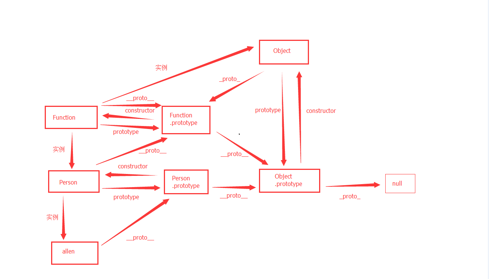

# 2022-01-js原型链

## 1. 综述
- 1. 每个对象都有__proto__，指向创造他的函数的prototype
- 2. 每个函数都有prototype，指向他的原型对象
- 3. 每个原型对象都有constructor，指向他的函数
- 4. 所有原型对象都一样，都有__proto__，指向Object.prototype
- 5. Object.prototype.__proto__指向null
- 5. Object.__proto__和Function.__proto__都指向Function.prototype
## 2. 代码演示
```
function Person(name) {
  this.name = name;
}

const allen = new Person();

/**
 * allen/Person/Person.prototype/Function/Function.prototype/Object/Object.prototype/null
 */
console.log(allen.__proto__ === Person.prototype);
console.log(Person.prototype.constructor === Person);
console.log(Person.__proto__ === Function.prototype);

console.log(Function.prototype.__proto__ === Person.prototype.__proto__);
console.log(Function.prototype.__proto__ === Object.prototype);
console.log(Object.prototype.__proto__ === null);

console.log(Function.__proto__ === Function.prototype);
console.log(Object.__proto__ === Function.prototype);
```
## 3. 关系图
