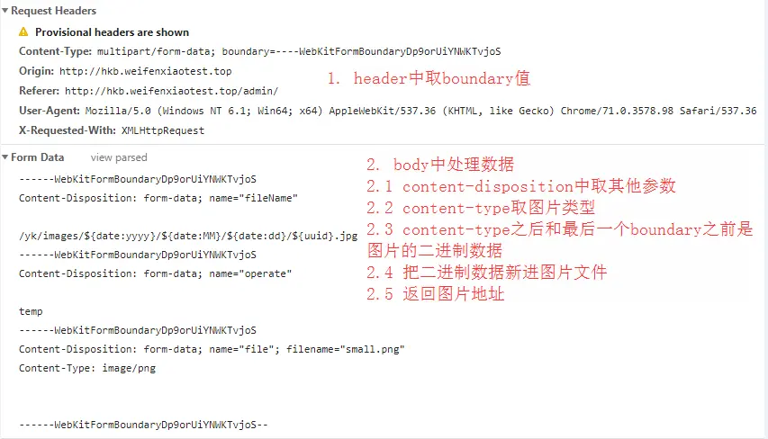

# 2022-01-图片上传组件前后台封装实现

## 1. antd的upload组件示例

```
<Upload name="zfile" action="/upload" data={{ operate: 'temp' }}></Upload>
```

我们的目标就是实现一个一样配置的ZUpload组件。

## 2. formdata实现图片上传

> XMLHttpRequest Level 2添加了一个新的接口FormData.利用FormData对象,我们可以通过JavaScript用一些键值对来模拟一系列表单控件,我们还可以使用XMLHttpRequest的send()方法来异步的提交这个"表单".比起普通的ajax,使用FormData的最大优点就是我们可以异步上传一个二进制文件


```
<input type="file" multiple={true} ref={ref => (this.input = ref)} />
```

```
componentDidMount() {
  const self = this;
  this.input.addEventListener('change', function(e) {
    //监听change事件，选择文件后触发
    console.log('>>>input.change', e);
    let formData = new FormData();
    for (let k in self.props.data) {
      formData.append(k, self.props.data[k]);
    }
    formData.append(self.props.name, e.target.files[0]);
    self
      .request(formData)
      .then(res => {
        console.log('>>>request.success', res);
        self.setState({ fileList: [...self.state.fileList, res.url] });
      })
      .catch(err => console.error('>>>request.fail', err));
  });
}
```

```
// 封装XMLHttpRequest
request = formData => {
  return new Promise((resolve, reject) => {
    let xhr = new XMLHttpRequest();
    xhr.open('post', this.props.action);
    xhr.responseType = 'json';
    xhr.onload = () => {
      console.log('onload', xhr);
      resolve(xhr.response, xhr);
    };
    xhr.onerror = () => reject(xhr);
    xhr.send(formData);
  });
};
```

> 代码地址:[zupload](https://gitee.com/changkong0310/demo-umi-ui/blob/master/myapp/src/components/z_upload/index.js)
参考文章:[formData实现图片上传](https://www.cnblogs.com/shapeY/p/7903414.html)
参考文章:[input[type='file']样式美化及实现图片预览](https://www.cnblogs.com/shapeY/p/7891636.html)
参考文章:[你真的会使用XMLHttpRequest吗？](https://segmentfault.com/a/1190000004322487)


## 3. express实现

express需要实现图片上传、静态服务器、图片下载三个功能。

### 3.1 express静态服务器实现

```
// 静态资源中间件
app.use(express.static("static"));
```

### 3.2 express+multer实现图片上传

```
const express = require("express");
const multer = require("multer");
const fs = require("fs");
const querystring = require('querystring')

const distFile = __dirname + "/static/upload";

const app = express();
// 主要配置
const storage = multer.diskStorage({
  destination: function(req, file, cb) {
    cb(null, distFile);
  },
  filename: function(req, file, cb) {
    const ext = file.originalname.split(".").pop();
    cb(null, `${new Date().valueOf()}.${ext}`);
  }
});

const upload = multer({ storage: storage });

// 判断staic/upload文件夹是否存在，如果不存在就新建一个
// recursive: true 支持递归创建
if (!fs.existsSync(distFile)) {
  fs.mkdir(distFile, { recursive: true }, err => {
    if (err) {
      throw new Error(err);
    }
  });
}

app.post("/upload", upload.single("zfile"), function(req, res, next) {
  // req.body 将具有文本域数据，如果存在的话
  console.log(querystring.encode(req.body)); //console.log(req.query.picTitle);//get
  console.log(req.file); //req.file文件的具体信息
  res.send({ url: "http://localhost:3000/upload/" + req.file.filename });
});

app.listen(3000, function() {
  console.log("Example app listening on port 3000!");
});
```

### 3.3 express+formidable实现图片上传

```
const formidable = require("formidable"); //载入formidable
const express = require("express");
const app = express();

app.post("/upload", function(req, res) {
  var form = new formidable.IncomingForm();
  form.encoding = "utf-8";
  form.uploadDir = "./static/upload";
  form.keepExtensions = true;

  form.parse(req, function(err, field, files) {
    console.log(files.zfile);
    console.log(field);//  field.opration
    const file = files.zfile;
    res.send({
      url: 'http://localhost:3000/'+file.path
    });
  });
});

app.listen(3000, function() {
  console.log("服务器已启动!");
});
```

### 3.4 图片下载

```
app.get('/download/:name', function(req,res){
  const filename = req.params.name
  console.log(filename)
  res.download(`static/upload/${filename}`, filename); 
});
```

## 4. koa实现图片上传、静态服务器和图片下载

- koa-body实现图片上传
- koa-static实现静态服务器
- koa-send实现图片下载

```
const Koa = require("koa");
const koaBody = require("koa-body");
const path = require("path");
const router = require("koa-router")();
const static = require("koa-static");
const send = require("koa-send");
const app = new Koa();
// 静态服务器
app.use(static(path.resolve(__dirname, "./static")));
// 上传
router.post(
  "/upload",
  koaBody({
    multipart: true,//默认是false，不支持文件上传
    formidable: {
      uploadDir: "static/upload",
      onFileBegin: (name, file) => {
        // rename
        const ext = file.name.split(".").pop(); // 获取上传文件扩展名
        const filePath = __dirname + "/static/upload/";
        const fileName = `${new Date().valueOf()}.${ext}`;
        file.name = fileName;
        file.path = path.resolve(filePath, fileName);
      }
    }
  }),
  ctx => {
    // => POST body
    // console.log("111", ctx.request.body);
    // console.log("222", ctx.request.files);
    const file = ctx.request.files.zfile;
    ctx.body = { url: "http://localhost:3000/upload/" + file.name };
  }
);
// 下载
router.get("/download/:name", async ctx => {
  const name = ctx.params.name;
  const path = `static/upload/${name}`;
  console.log("download", name);
  ctx.attachment(path);
  await send(ctx, path);
});

app.use(router.routes());

app.listen(3000, () => {
  console.log("koa is listening in 3000");
});
```

> 代码地址:[demo-node-uplaod](https://gitee.com/changkong0310/demo-node/tree/master/upload)


## 5. node原生实现formdata图片上传原理

> 本质是body转为字符串后的字符串操作




> 参考文章:[Node.js HTTP服务器中的文件、图片上传](https://houbean.github.io/2017/02/22/Node-js-HTTP%E6%9C%8D%E5%8A%A1%E5%99%A8%E4%B8%AD%E7%9A%84%E6%96%87%E4%BB%B6%E3%80%81%E5%9B%BE%E7%89%87%E4%B8%8A%E4%BC%A0/)


## 6. node原生处理post请求

```
<form id="form1" method="post" action="submit">
  <fieldset>
    <legend>表单1</legend>
    姓名:<input type="text" name="username" />

    学历:<select name="education">
      <option value="中学">中学</option>
      <option value="大专">大专</option>
      <option value="本科">本科</option>
      <option value="硕士">硕士</option>
      <option value="博士">博士</option> </select
    >

    住址:<input type="text" name="address" /> 隐藏:<input
      name="hide"
      disabled="disabled"
      value="111"
    />
    <input type="submit" value="提交" />
  </fieldset>
</form>
```

```
function handleSubmit(req, res) {
  var urlstr = "";
  req.addListener("data", function(postdata) {
    urlstr += postdata; //接收到的表单数据字符串，这里可以用两种方法将UTF-8编码转换为中文
  });
  req.addListener("end", function() {
    var decodedata = decodeURIComponent(urlstr); //对表单数据进行解码
    res.writeHead(200, { "Content-Type": "text/plain; charset=utf-8" });
    res.write(decodedata);
    res.end();
  });
}
```

## 7. node原生实现静态服务器

```
function handleStatic(req, res) {
  const fileName = Path.resolve(__dirname, "." + req.url);
  const extName = Path.extname(fileName).substr(1);

  if (fs.existsSync(fileName)) {
    //判断本地文件是否存在
    var mineTypeMap = {
      html: "text/html;charset=utf-8",
      htm: "text/html;charset=utf-8",
      xml: "text/xml;charset=utf-8",
      png: "image/png",
      jpg: "image/jpeg",
      jpeg: "image/jpeg",
      gif: "image/gif",
      css: "text/css;charset=utf-8",
      txt: "text/plain;charset=utf-8",
      mp3: "audio/mpeg",
      mp4: "video/mp4",
      ico: "image/x-icon",
      tif: "image/tiff",
      svg: "image/svg+xml",
      zip: "application/zip",
      ttf: "font/ttf",
      woff: "font/woff",
      woff2: "font/woff2"
    };
    if (mineTypeMap[extName]) {
      res.setHeader("Content-Type", mineTypeMap[extName]);
    }
    var stream = fs.createReadStream(fileName);
    stream.pipe(res);
  } else {
    res.writeHead(200, "Okay");
    res.write("not found");
    res.end();
  }
}
```

> 参考文章:[关于实现一个Node.js静态服务器你所需要知道的ALL](https://juejin.im/post/5a9660fe6fb9a0634b4da9ae)


## 8. node原生实现下载

```
function handleDownload(req, res) {
  // 实现文件下载
  var fileName = req.url.replace("download", "static/upload");
  var filePath = Path.join(__dirname, fileName);
  var stats = fs.statSync(filePath);
  if (stats.isFile()) {
    res.setHeader("Content-Type", "application/octet-stream");
    res.setHeader("Content-Disposition", "attachment; filename=" + fileName);
    res.setHeader("Content-Length", stats.size);
    fs.createReadStream(filePath).pipe(res);
  } else {
    res.end(404);
  }
}
```

主要是两个http头：

- Content-Type: application/octet-stream
- Content-Disposition: attachment; filename=MyFileName.ext

`Content-Type: application/octet-stream`告诉浏览器这是一个二进制文件，`Content-Disposition`告诉浏览器这是一个需要下载的附件并告诉浏览器默认的文件名。如果不添加`Content-Disposition`响应头，浏览器可能会下载或显示文件内容，不同浏览器的处理有所不同。

> 参考文章:[Node.js 中实现HTTP文件下载](https://itbilu.com/nodejs/core/Nkvh9yS4W.html)

