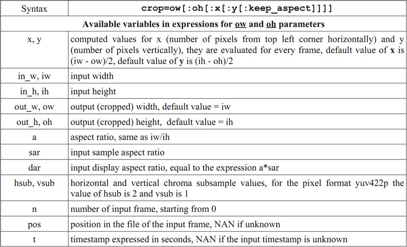
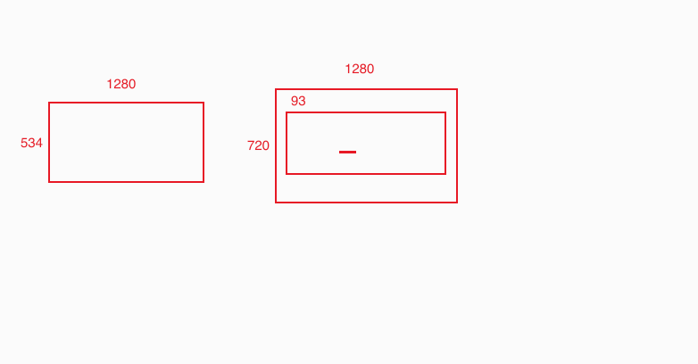

# 2022-05-ffmpeg常用命令和常用案例

## 参考文档
- [ffmpeg官方文档]([http://www.ffmpeg.org/ffmpeg.html#Options](http://www.ffmpeg.org/ffmpeg.html#Options))
- [ffmpeg-阮一峰]([http://www.ruanyifeng.com/blog/2020/01/ffmpeg.html](http://www.ruanyifeng.com/blog/2020/01/ffmpeg.html))
- [ffmpeg功能命令]([https://www.jianshu.com/p/7a186943cbdd](https://www.jianshu.com/p/7a186943cbdd))
## 基本知识
### 1. 容器
视频文件本身其实是一个容器（container），里面包括了视频和音频，也可能有字幕等其他内容。
常见的容器格式有以下几种。一般来说，视频文件的后缀名反映了它的容器格式。

- MP4
- MKV
- WebM
- AVI

下面的命令查看 FFmpeg 支持的容器。
```
$ ffmpeg -formats
```
> MP4包含H.264和aac

### 2. 编码格式
视频和音频都需要经过编码，才能保存成文件。不同的编码格式（CODEC），有不同的压缩率，会导致文件大小和清晰度的差异。

常用的视频编码格式如下。

- H.262
- H.264
- H.265

上面的编码格式都是有版权的，但是可以免费使用。此外，还有几种无版权的视频编码格式。

- VP8
- VP9
- AV1

常用的音频编码格式如下。

- MP3
- AAC

上面所有这些都是有损的编码格式，编码后会损失一些细节，以换取压缩后较小的文件体积。无损的编码格式压缩出来的文件体积较大，这里就不介绍了。
下面的命令可以查看 FFmpeg 支持的编码格式，视频编码和音频编码都在内。
```
$ ffmpeg -codecs
```
### 3. 编码器
编码器（encoders）是实现某种编码格式的库文件。只有安装了某种格式的编码器，才能实现该格式视频/音频的编码和解码。

以下是一些 FFmpeg 内置的视频编码器。

- libx264：最流行的开源 H.264 编码器
- NVENC：基于 NVIDIA GPU 的 H.264 编码器
- libx265：开源的 HEVC 编码器
- libvpx：谷歌的 VP8 和 VP9 编码器
- libaom：AV1 编码器

音频编码器如下。

- libfdk-aac
- aac

下面的命令可以查看 FFmpeg 已安装的编码器。
```
$ ffmpeg -encoders
```
### 3. FFmpeg 的使用格式
FFmpeg 的命令行参数非常多，可以分成五个部分。
```
$ ffmpeg {1} {2} -i {3} {4} {5}
```
上面命令中，五个部分的参数依次如下。

1. 全局参数
2. 输入文件参数
3. 输入文件
4. 输出文件参数
5. 输出文件

参数太多的时候，为了便于查看，ffmpeg 命令可以写成多行。
```
$ ffmpeg \
[全局参数] \
[输入文件参数] \
-i [输入文件] \
[输出文件参数] \
[输出文件]
```

下面是一个例子。
```
$ ffmpeg \
-y \ # 全局参数
-c:a libfdk_aac -c:v libx264 \ # 输入文件参数
-i input.mp4 \ # 输入文件
-c:v libvpx-vp9 -c:a libvorbis \ # 输出文件参数
output.webm # 输出文件
```

上面的命令将 mp4 文件转成 webm 文件，这两个都是容器格式。输入的 mp4 文件的音频编码格式是 aac，视频编码格式是 H.264；输出的 webm 文件的视频编码格式是 VP9，音频格式是 Vorbis。

如果不指明编码格式，FFmpeg 会自己判断输入文件的编码。因此，上面的命令可以简单写成下面的样子。
```
$ ffmpeg -i input.avi output.mp4
```
## 常用命令
### 1. [Generic options](http://www.ffmpeg.org/ffmpeg.html#toc-Generic-options)

- -L : Show license.
- -h --help : 帮助
- -version : 版本
- -formats : 查询所有支持的视频容器
- -codes : 查询所有支持的音视频编码格式
- -encoders : 插座箱所有支持的编码器
- ...
### 2. [Main options](http://www.ffmpeg.org/ffmpeg.html#toc-Main-options)

- -f : fmt (_input/output_)
- -i : url (_input_)
- -t : duration (_input/output_)
- -ss : 开始时间 (_input/output_)
- -c : 指定编码器
- -c:a : 指定音频编码器
- -c:v : 指定视频编码器
- -q:v : 质量，其值为1-5，1最高
- -loop : 循环，值为1表示无限循环
- ...
### 3. [Video Options](http://www.ffmpeg.org/ffmpeg.html#toc-Video-Options)

- -minrate : 最小码率
- -maxrate ：最大码率
- -bufsize : 缓存大小
- -vf  : filtergraph (过滤器)
- -vn : 去掉音频
- -vframes : 截取帧数
### 4. [Advanced options](http://www.ffmpeg.org/ffmpeg.html#toc-Advanced-options)

- -shortest : 参数表示音频文件结束，输出视频就结束。
## 常用案例
### 1. 查看文件信息
```
$ ffmpeg -i input.mp4
```
上面命令会输出很多冗余信息，加上-hide_banner参数，可以只显示元信息。
```
$ ffmpeg -i input.mp4 -hide_banner
```
### 2. 转换编码格式
转换编码格式（transcoding）指的是， 将视频文件从一种编码转成另一种编码。比如转成 H.264 编码，一般使用编码器libx264，所以只需指定输出文件的视频编码器即可。
```
$ ffmpeg -i [input.file] -c:v libx264 output.mp4
```
下面是转成 H.265 编码的写法。
```
$ ffmpeg -i [input.file] -c:v libx265 output.mp4
```
### 3. 转换容器格式
转换容器格式（transmuxing）指的是，将视频文件从一种容器转到另一种容器。下面是 mp4  转 webm 的写法。
```
$ ffmpeg -i input.mp4 -c copy output.webm
```
面例子中，只是转一下容器，内部的编码格式不变，所以使用-c copy指定直接拷贝，不经过转码，这样比较快。
### 4. 调整码率
调整码率（transrating）指的是，改变编码的比特率，一般用来将视频文件的体积变小。下面的例子指定码率最小为964K，最大为3856K，缓冲区大小为 2000K。
```
$ ffmpeg \
-i input.mp4 \
-minrate 964K -maxrate 3856K -bufsize 2000K \
output.mp4
```
### 5. 改变分辨率（transsizing）

下面是改变视频分辨率（transsizing）的例子，从 1080p 转为 480p 。
```
$ ffmpeg \
-i input.mp4 \
-vf scale=480:-1 \
output.mp4
```
### 6. 提取音频
有时，需要从视频里面提取音频（demuxing），可以像下面这样写。
```
$ ffmpeg \
-i input.mp4 \
-vn -c:a copy \
output.aac
```
上面例子中，-vn表示去掉视频，-c:a copy表示不改变音频编码，直接拷贝。
### 7. 添加音轨
添加音轨（muxing）指的是，将外部音频加入视频，比如添加背景音乐或旁白。
```
$ ffmpeg \
-i input.aac -i input.mp4 \
output.mp4
```
上面例子中，有音频和视频两个输入文件，FFmpeg 会将它们合成为一个文件。
### 8. 截图
下面的例子是从指定时间开始，连续对1秒钟的视频进行截图。
```

$ ffmpeg \
-y \
-i input.mp4 \
-ss 00:01:24 -t 00:00:01 \
output_%3d.jpg
```
如果只需要截一张图，可以指定只截取一帧。
```
$ ffmpeg \
-ss 01:23:45 \
-i input \
-vframes 1 -q:v 2 \
output.jpg
```
上面例子中，-vframes 1指定只截取一帧，-q:v 2表示输出的图片质量，一般是1到5之间（1 为质量最高）。
### 9. 裁剪
裁剪（cutting）指的是，截取原始视频里面的一个片段，输出为一个新视频。可以指定开始时间（start）和持续时间（duration），也可以指定结束时间（end）。
```
$ ffmpeg -ss [start] -i [input] -t [duration] -c copy [output]
$ ffmpeg -ss [start] -i [input] -to [end] -c copy [output]
```
下面是实际的例子。
```
$ ffmpeg -ss 00:01:50 -i [input] -t 10.5 -c copy [output]
$ ffmpeg -ss 2.5 -i [input] -to 10 -c copy [output]
```
上面例子中，-c copy表示不改变音频和视频的编码格式，直接拷贝，这样会快很多。
### 10. 为音频添加封面


有些视频网站只允许上传视频文件。如果要上传音频文件，必须为音频添加封面，将其转为视频，然后上传。
下面命令可以将音频文件，转为带封面的视频文件。
```
$ ffmpeg \
-loop 1 \
-i cover.jpg -i input.mp3 \
-c:v libx264 -c:a aac -b:a 192k -shortest \
output.mp4
```
上面命令中，有两个输入文件，一个是封面图片cover.jpg，另一个是音频文件input.mp3。-loop 1参数表示图片无限循环，-shortest参数表示音频文件结束，输出视频就结束。
### 11. 调整视频的大小和尺寸
调整视频大小(resize)是改变视频的宽度和高度。使用-s参数实现，语法：
```
ffmpeg  -i  input_file  -s  wxh  output_file (wxh是宽x高，比如320x240)
```
### 12. 视频裁剪
视频裁剪使用crop视频滤镜，它可以把视频从指定的x、y位置裁剪成指定的w、h。坐标系是基于左上点开始的。

```
ffmpeg -i input_file -vf crop=iw:ih:x:y output_file
```
比如有一个竖向的视频 1080 x 1920，如果指向保留中间 1080×1080 部分命令如下：
```
ffmpeg -i input_file -strict -2 -vf crop=1080:1080:0:420 output_file
```

其中的 crop=1080:1080:0:420 才裁剪参数，具体含义是 crop=width:height:x:y，其中 width 和 height 表示裁剪后的尺寸，x:y 表示裁剪区域的左上角坐标。比如当前这个示例，我们只需要保留竖向视频的中间部分，所以 x 不用偏移，故传入0，而 y 则需要向下偏移：(1920 – 1080) / 2 = 420

> 超出原视频的尺寸会报错，可能无法实现多余部分用黑色补齐的需求

### 13. 加黑边
使用FFmpeg给视频增加黑边需要用到 pad 这个滤镜，具体用法如下：
```
-vf pad=1280:720:0:93:black
```
按照从左到右的顺序依次为:“宽”、“高”、“X坐标”和“Y坐标”，宽和高指的是输入视频尺寸（包含加黑边的尺寸），XY指的是视频所在位置。

比如一个输入视频尺寸是1280x534的源，想要加上黑边变成1280x720，那么用上边的语法可以实现，93是这样得来的，（720-534）/2。


如果视频原始1920x800的话，完整的语法应该是：-vf 'scale=1280:534,pad=1280:720:0:93:black'先将视频缩小到1280x534，然后在加入黑边变成1280x720，将1280x534的视频放置在x=0，y=93的地方，FFmpeg会自动在上下增加93像素的黑边。

> 注：black可以不写，默认是黑色

