# 2022-06-svg

## 1. 文档
- [MDN>Web 开发技术>SVG](https://developer.mozilla.org/zh-CN/docs/Web/SVG)
- [理解CSS3 transform中的Matrix(矩阵)](https://www.zhangxinxu.com/wordpress/2012/06/css3-transform-matrix-%E7%9F%A9%E9%98%B5/)
- [transform matrix重点解析](https://zhuanlan.zhihu.com/p/74279787)
- [数据库可视化>SVG进阶](http://www.youbaobao.xyz/datav-docs/guide/libs/svg.html)

## 2. currentColor
css3的一个关键字，可以继承父元素的颜色，这里主要在svg中使用。
```javascript
export default function SvgDemo() {
  return (
    <svg width='100%' height='100%'>
      <rect x="10" y="10" width="30" height="30" stroke="currentColor" fill="transparent" stroke-width="5"></rect>
    </svg>
  )
}
```
```javascript
export default function TestPage() {
  return (
    <div style={{ color: 'lightblue' }}>
      <SvgDemo />
    </div>
  )
}
```
上面的代码，currentColor可以使用外层的color属性，width和height设置为100%还可以继承外层的宽高属性。

## 2. viewport和viewbox

- viewport 是 svg 图像的可见区域
- viewBox 是用于在画布上绘制 svg 图形的坐标系统

简单的说

- viewport: 视口的大小，通过width和height描述
- viewBox: 用来描述svg的缩放

下面用例子说明下
```html
// A
<svg width='100%' height='100%'>
  <rect x="10" y="10" width="80" height="80" stroke="currentColor" fill="transparent" stroke-width="5"></rect>
</svg>
```
```html
// B
<svg width='100%' height='100%' viewBox='0 0 100 100'>
  <rect x="10" y="10" width="80" height="80" stroke="currentColor" fill="transparent" stroke-width="5"></rect>
</svg>
```
```html
<div style={{ color: 'lightblue', display: 'flex' }}>
  <div style={{ width: 200, height: 200, border: '1px solid gray' }}>
    <SvgDemo />
  </div>
  <div style={{ width: 200, height: 200, border: '1px solid gray', marginLeft: 10 }}>
    <SvgDemo1 />
  </div>
</div>
```
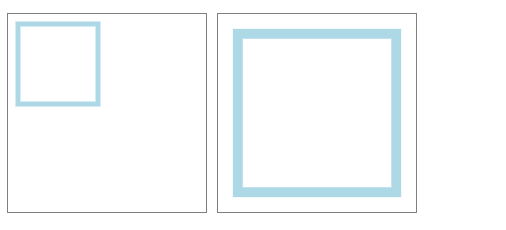
上面的结果可以看出，未设置viewBox的svg保持了原样大小，设置了viewBox的svg跟父组件一起缩放了。

## 3. preserveAspectRatio
如果viewport和viewBox的宽高比一致，是没有问题的。如果两者的宽高比不一致，就会有问题。比如:
```html
<svg width="100%" height="100%" viewBox="0 0 200 200" style={{ border: '1px solid #000000' }}>
  <rect x="100" y="100" width="100" height="50" stroke-width="10" style={{ stroke: '#000000', fill: 'none' }} />
</svg>
```
```html
<div style={{ width: 500, height: 200, border: '1px solid gray' }}>
  <SvgDemo />
</div>
```
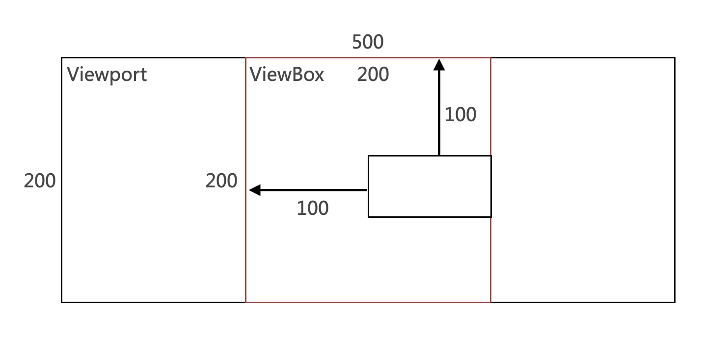
为什么会在这个位置呢？我们要看一下preserveAspectRatio的默认参数xMidYMid meet。这是两个值，第一个值是Xmid/Xmin/Xmax和Ymid/Ymin/Ymax的组合值，表示X或者Y轴的最小值(左边、上边)、mid(中间)、max(右边、下边).

第二个参数有三个值，meet/slice/none.

- meet: 保持宽高比并将viewBox缩放为适合viewport的大小，meet 模式下，svg 将优先采纳压缩比较小的作为最终压缩比，meet 是默认参数。
- slice: 保持宽高比并将所有不在viewport中的viewBox剪裁掉，slice 模式下，svg 将优先采纳压缩比较大的作为最终压缩比。
- none: 不保存宽高比。缩放图像适合整个viewbox，可能会发生图像变形，none 模式下，svg 将分别计算 x 和 y 轴的压缩比。

> 现在分析上面的例子，默认是xMidYMid meet，meet模式下，采用压缩比小的也就是y轴的比例为1，然后y轴不用考虑，svg画到x轴的中间，在中间位置起始100px，往右画100px的框。

## 4. defs/g/symbol/use
前面都是单个svg的写法，如果我们写了一个通用的svg，其他地方引用这个svg，怎么实现呢？defs/g/symbol/use就是来解决这个问题的。

- defs：自定义，一般用来包裹
- g: group，几个形状组成一个标签
- symbol: 同g标签，但可以加自己的viewBox，更牛。
- use: 使用svg

例子代码
```html
// html中定义svg组件库
<svg>
  <symbol id='rect' width="100%" height="100%" viewBox="0 0 200 200" >
    <rect x="100" y="100" width="100" height="50" stroke-width="10" style={{ stroke: '#000000', fill: 'none' }} />
  </symbol>
  <symbol id='circle' width="100%" height="100%" viewBox="0 0 200 200">
    <circle cx="50" cy="50" r="50" style={{ stroke: '#000000', fill: 'none' }} />
  </symbol>
  <symbol id='line' width="100%" height="100%" viewBox="0 0 200 200">
    <line x1="0" y1="0" x2="200" y2="0" style={{ stroke: '#000000', fill: 'none' }} />
  </symbol>
</svg>
```

```html
// 使用
<div style={{ color: 'lightblue', display: 'flex', margin: 20 }}>
  <div style={{ width: 200, height: 200, border: '1px solid gray' }}>
    <svg>
      <use href='#rect' />
    </svg>
  </div>
  <div style={{ width: 200, height: 200, border: '1px solid gray' }}>
    <svg>
      <use href='#circle' />
    </svg>
  </div>
  <div style={{ width: 200, height: 200, border: '1px solid gray' }}>
    <svg>
      <use href='#line' />
    </svg>
  </div>
</div>

```

## 5. iconfont的symbol的使用方式和原理
### 5.1 iconfont中添加图标到项目
> 选择图标添加到购物车 > 把购物车的图标添加到项目

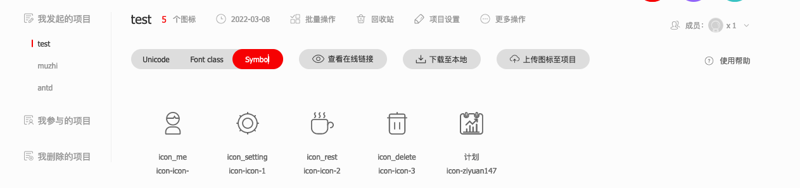
### 5.2 使用symbol方式引用图标
点击下载至本地或者生成在线链接，会拿到一份js，格式化之后js如下：
```javascript
! function (a) {
    var t, e, n, o, i, c =
        `
        <svg>
               <symbol id="icon-icon-" viewBox="0 0 1024 1024">
                              <path d="M472.064 611.9424a307.2 307.2 0 1 0-264.8064-264.8064 307.2 307.2 0 0 0 264.8064 264.8064zM512 563.2a256.2048 256.2048 0 0 1-255.7952-253.1328h282.2144a20.48 20.48 0 0 0 17.6128-10.24l27.8528-47.9232 31.744 48.7424a20.48 20.48 0 0 0 17.2032 9.216h134.9632A256.2048 256.2048 0 0 1 512 563.2z m0-512a256.4096 256.4096 0 0 1 251.2896 207.6672H655.36a10.24 10.24 0 0 1-8.6016-4.7104l-65.3312-99.9424-57.7536 99.328a10.24 10.24 0 0 1-8.8064 5.12H260.7104A256.4096 256.4096 0 0 1 512 51.2zM614.4 655.36H409.6A245.76 245.76 0 0 0 163.84 901.12v81.92a40.96 40.96 0 0 0 40.96 40.96h614.4a40.96 40.96 0 0 0 40.96-40.96v-81.92a245.76 245.76 0 0 0-245.76-245.76z m194.56 317.44h-593.92V901.12a194.7648 194.7648 0 0 1 194.56-194.56h204.8a194.7648 194.7648 0 0 1 194.56 194.56z"></path>
               </symbol>
               <symbol id="icon-icon-1" viewBox="0 0 1024 1024">
                              <path d="M997.601918 486.011191H961.790568a448.358114 448.358114 0 0 0-113.573142-274.007994l25.988809-25.988809a25.579536 25.579536 0 1 0-36.220623-36.220623l-26.807355 25.988809A448.358114 448.358114 0 0 0 537.170264 61.390887V25.579536a25.579536 25.579536 0 0 0-51.159073 0V61.390887a448.358114 448.358114 0 0 0-274.007994 114.391687L186.014388 149.793765a25.579536 25.579536 0 1 0-36.220623 36.220623l25.988809 25.988809A448.358114 448.358114 0 0 0 61.390887 486.011191H25.579536a25.579536 25.579536 0 0 0 0 51.159073H61.390887a448.358114 448.358114 0 0 0 114.391687 274.007993l-25.988809 25.988809a25.579536 25.579536 0 0 0 36.220623 36.220624l25.988809-25.988809A448.358114 448.358114 0 0 0 486.011191 961.790568v36.629896a25.579536 25.579536 0 0 0 51.159073 0V961.790568a448.358114 448.358114 0 0 0 274.007993-113.573142l25.988809 25.988809a25.579536 25.579536 0 1 0 36.220624-36.220623l-25.988809-25.988809A448.358114 448.358114 0 0 0 961.790568 537.170264h36.629896a25.579536 25.579536 0 0 0 0-51.159073zM511.590727 910.631495A399.040767 399.040767 0 1 1 910.631495 511.590727 399.45004 399.45004 0 0 1 511.590727 910.631495z"></path>
                              <path d="M511.590727 260.911271A250.679456 250.679456 0 1 0 762.270184 511.590727 250.884093 250.884093 0 0 0 511.590727 260.911271z m0 450.19984A199.520384 199.520384 0 1 1 711.111111 511.590727 199.72502 199.72502 0 0 1 511.590727 711.111111z"></path>
               </symbol>
               <symbol id="icon-icon-2" viewBox="0 0 1024 1024">
                              <path d="M655.36 368.64a71.68 71.68 0 0 1 71.68 71.68v286.72A235.52 235.52 0 0 1 491.52 962.56H286.72A235.52 235.52 0 0 1 51.2 726.4256v-286.72A71.68 71.68 0 0 1 122.88 368.64h532.48m0-51.2H122.88a122.88 122.88 0 0 0-122.88 122.88v286.72a286.72 286.72 0 0 0 286.72 286.72h204.8a286.72 286.72 0 0 0 286.72-286.72v-286.72a122.88 122.88 0 0 0-122.88-122.88z"></path>
                              <path d="M875.7248 738.304a25.6 25.6 0 1 1 0-51.2A97.28 97.28 0 1 0 778.24 590.0288a25.6 25.6 0 0 1-51.2 0 148.2752 148.2752 0 1 1 148.2752 148.2752zM159.744 282.2144a25.6 25.6 0 0 1-12.4928-47.9232c8.6016-4.9152 33.1776-23.1424 32.1536-40.96a61.44 61.44 0 0 0-19.0464-36.0448 94.6176 94.6176 0 0 1-28.2624-62.8736A93.184 93.184 0 0 1 184.32 13.7216a25.6 25.6 0 0 1 22.528 45.8752A43.4176 43.4176 0 0 0 184.32 94.4128c0 9.8304 5.5296 16.9984 16.384 29.696a108.1344 108.1344 0 0 1 30.9248 65.7408c3.072 53.4528-52.0192 85.6064-58.368 89.088a25.6 25.6 0 0 1-13.5168 3.2768zM367.2064 282.2144a25.6 25.6 0 0 1-12.4928-47.9232c8.6016-4.9152 33.1776-23.1424 32.1536-40.96A61.44 61.44 0 0 0 368.64 156.8768a94.8224 94.8224 0 0 1-28.2624-62.464 93.184 93.184 0 0 1 51.2-80.6912 25.6 25.6 0 0 1 22.528 45.8752 43.4176 43.4176 0 0 0-23.552 34.816c0 9.6256 5.5296 16.9984 16.384 29.696a108.1344 108.1344 0 0 1 30.9248 65.7408c3.072 53.4528-52.0192 85.6064-58.368 89.088a25.6 25.6 0 0 1-12.288 3.2768zM574.6688 282.2144a25.6 25.6 0 0 1-12.4928-47.9232c8.6016-4.9152 33.1776-23.1424 31.9488-40.96a61.44 61.44 0 0 0-19.0464-36.0448 94.6176 94.6176 0 0 1-28.2624-62.464A93.184 93.184 0 0 1 599.04 13.7216a25.6 25.6 0 0 1 22.528 45.8752 43.4176 43.4176 0 0 0-23.552 34.816c0 9.8304 5.5296 16.9984 16.384 29.696a108.1344 108.1344 0 0 1 30.9248 65.7408c3.072 53.4528-52.0192 85.6064-58.1632 89.088a25.6 25.6 0 0 1-12.4928 3.2768z"></path>
               </symbol>
               <symbol id="icon-icon-3" viewBox="0 0 1024 1024">
                              <path d="M942.08 240.64h-56.32V160.3584A87.04 87.04 0 0 0 798.72 73.3184H537.6V25.6a25.6 25.6 0 0 0-51.2 0v47.7184H225.28a87.04 87.04 0 0 0-87.04 87.04v80.2816H81.92a25.6 25.6 0 0 0 0 51.2h56.32v583.68A148.6848 148.6848 0 0 0 286.72 1024h450.56a148.6848 148.6848 0 0 0 148.48-148.48v-583.68H942.08a25.6 25.6 0 0 0 0-51.2zM189.44 160.3584A35.84 35.84 0 0 1 225.28 124.5184h573.44a35.84 35.84 0 0 1 35.84 35.84v80.2816H189.44z m645.12 715.1616A97.4848 97.4848 0 0 1 737.28 972.8H286.72a97.4848 97.4848 0 0 1-97.28-97.28v-583.68h645.12z"></path>
                              <path d="M399.36 796.672a25.6 25.6 0 0 0 25.6-25.6v-286.72a25.6 25.6 0 1 0-51.2 0v286.72a25.6 25.6 0 0 0 25.6 25.6zM624.64 796.672a25.6 25.6 0 0 0 25.6-25.6v-286.72a25.6 25.6 0 1 0-51.2 0v286.72a25.6 25.6 0 0 0 25.6 25.6z"></path>
               </symbol>
               <symbol id="icon-ziyuan147" viewBox="0 0 1052 1024">
                              <path d="M855.777357 890.085923H785.776817a23.517968 23.517968 0 0 0 0-3.873548V561.111051a30.7117 30.7117 0 0 0-32.925155-27.668198 30.7117 30.7117 0 0 0-32.925156 27.668198v323.994596a23.79465 23.79465 0 0 0 0 3.873548h-91.305052a23.79465 23.79465 0 0 0 0-3.873548v-197.550932a30.7117 30.7117 0 0 0-32.925156-27.668198 30.7117 30.7117 0 0 0-32.925155 27.668198v197.550932a23.241286 23.241286 0 0 0 0 3.873548H486.960281a23.517968 23.517968 0 0 0 0-3.873548v-259.251013a33.201837 33.201837 0 0 0-65.850311 0v259.251013a23.79465 23.79465 0 0 0 0 3.873548h-79.131045a24.071332 24.071332 0 0 0 0-3.873548v-110.672791a30.7117 30.7117 0 0 0-32.925156-27.668198 30.7117 30.7117 0 0 0-32.925155 27.668198v110.672791A23.79465 23.79465 0 0 0 276.681978 890.085923H166.009187a27.668198 27.668198 0 0 0 0 55.336395h691.704944a30.7117 30.7117 0 0 0 32.925156-27.668197 30.7117 30.7117 0 0 0-34.86193-27.668198z"></path>
                              <path d="M301.860038 606.763577l138.340989-138.340989 123.953526 123.953527 181.780059-181.78006v34.308565a31.265063 31.265063 0 0 0 31.265064 31.265064 31.265063 31.265063 0 0 0 31.265063-31.265064v-112.332883a31.265063 31.265063 0 0 0-31.265063-31.265063h-106.522562a31.265063 31.265063 0 0 0-31.265063 31.265063A31.265063 31.265063 0 0 0 670.677114 364.390165h32.925156l-140.554445 140.554445-123.953526-123.953527-181.503378 181.503378a31.265063 31.265063 0 1 0 44.269117 44.269116zM288.855985 220.515536a59.209943 59.209943 0 0 0 62.253445-57.273169V61.976763A59.209943 59.209943 0 0 0 288.855985 4.703594a59.209943 59.209943 0 0 0-62.253445 57.273169v101.265604a59.209943 59.209943 0 0 0 62.253445 57.273169z m-15.217509-158.538773c0-5.53364 6.917049-10.237233 15.217509-10.237233s15.217509 4.703594 15.217509 10.237233v101.265604c0 5.53364-6.917049 10.237233-15.217509 10.237233s-15.217509-4.703594-15.217509-10.237233zM758.661983 220.515536a59.209943 59.209943 0 0 0 61.976763-57.273169V61.976763a61.976763 61.976763 0 0 0-123.953526 0v101.265604a59.209943 59.209943 0 0 0 61.976763 57.273169z m-14.940827-158.538773c0-5.53364 6.640367-10.237233 14.940827-10.237233s14.940827 4.703594 14.940827 10.237233v101.265604c0 5.53364-6.640367 10.237233-14.940827 10.237233s-14.940827-4.703594-14.940827-10.237233z"></path>
                              <path d="M920.52094 60.039989h-33.201837a60.870035 60.870035 0 0 0-60.870035 60.870035V170.71278a61.146717 61.146717 0 0 1-60.593353 55.336396c-63.083491 2.213456-74.15077-27.668198-76.640908-55.336396V120.633342A60.870035 60.870035 0 0 0 628.344772 60.039989h-209.171576A60.870035 60.870035 0 0 0 359.686571 120.633342v47.865983C359.686571 195.89084 340.318833 226.049176 289.409349 226.049176a74.15077 74.15077 0 0 1-53.676304-18.814375A49.802756 49.802756 0 0 1 221.345582 170.71278V119.803296A60.870035 60.870035 0 0 0 159.922183 60.039989H126.997028A126.997028 126.997028 0 0 0 0 185.930289v711.072683a126.997028 126.997028 0 0 0 126.997028 126.997028h793.523912a126.997028 126.997028 0 0 0 126.997028-126.997028V185.930289A126.166982 126.166982 0 0 0 920.52094 60.039989z m71.660633 836.132937a71.660632 71.660632 0 0 1-71.660633 71.660632H126.997028A71.660632 71.660632 0 0 1 55.336396 897.002972V185.930289A71.660632 71.660632 0 0 1 126.997028 115.376385h33.201837a5.53364 5.53364 0 0 1 5.53364 5.533639V170.71278a105.415834 105.415834 0 0 0 30.988381 76.087544A125.613618 125.613618 0 0 0 290.239395 281.385571C375.180762 281.385571 415.022967 222.175628 415.022967 168.499325V120.633342a5.53364 5.53364 0 0 1 5.533639-5.533639h209.171576a5.53364 5.53364 0 0 1 5.533639 5.533639v55.336396c7.193731 71.107268 55.336396 110.672791 133.360713 107.629289A115.929749 115.929749 0 0 0 882.062145 170.71278V121.463388a5.53364 5.53364 0 0 1 5.53364-5.533639h33.201837a71.660632 71.660632 0 0 1 71.660633 70.00054z"></path>
               </symbol>
</svg>
        `
        h = (h = document.getElementsByTagName("script"))[h.length - 1].getAttribute("data-injectcss"),
        d = function (a, t) {
            t.parentNode.insertBefore(a, t)
        };
    if (h && !a.__iconfont__svg__cssinject__) {
        a.__iconfont__svg__cssinject__ = !0;
        try {
            document.write(
                "<style>.svgfont {display: inline-block;width: 1em;height: 1em;fill: currentColor;vertical-align: -0.1em;font-size:16px;}</style>"
            )
        } catch (a) {
            console && console.log(a)
        }
    }

    function l() {
        i || (i = !0, n())
    }

    function v() {
        try {
            o.documentElement.doScroll("left")
        } catch (a) {
            return void setTimeout(v, 50)
        }
        l()
    }
    t = function () {
        var a, t = document.createElement("div");
        t.innerHTML = c, c = null, (t = t.getElementsByTagName("svg")[0]) && (t.setAttribute("aria-hidden", "true"),
            t.style.position = "absolute", t.style.width = 0, t.style.height = 0, t.style.overflow = "hidden",
            t = t, (a = document.body).firstChild ? d(t, a.firstChild) : a.appendChild(t))
    }, document.addEventListener ? ~["complete", "loaded", "interactive"].indexOf(document.readyState) ? setTimeout(
        t, 0) : (e = function () {
        document.removeEventListener("DOMContentLoaded", e, !1), t()
    }, document.addEventListener("DOMContentLoaded", e, !1)) : document.attachEvent && (n = t, o = a.document, i = !
        1, v(), o.onreadystatechange = function () {
            "complete" == o.readyState && (o.onreadystatechange = null, l())
        })
}(window);
```
项目中使用图标
```html
<div style={{ color: 'lightblue', display: 'flex', margin: 20 }}>
  <div style={{ width: 200, height: 200, border: '1px solid gray' }}>
    <svg className="icon" aria-hidden="true">
      <use href="#icon-icon-"></use>
    </svg>
  </div>
  <div style={{ width: 200, height: 200, border: '1px solid gray' }}>
    <svg className="icon" aria-hidden="true">
      <use href="#icon-icon-1"></use>
    </svg>
  </div>
  <div style={{ width: 200, height: 200, border: '1px solid gray' }}>
    <svg className="icon" aria-hidden="true">
      <use href="#icon-icon-2"></use>
    </svg>
  </div>
</div>
```

### 5.3 原理
js把svg图标库插入html中，再用svg的use标签引用。
## 6. antd/icons的原理

## 7. react如何高效使用svg

## 8. transform和matrix
css3中有transform属性，可以实现元素的位移(translate)、缩放(scale)、斜切(skew)、旋转(rotate)。svg中也有transfom属性。
### 8.1 transform的基本用法
```html
// transform基本用法
<svg>
  <rect
        x="50"
        y="50"
        width="100"
        height="50"
        stroke-width="10"
        style={{ stroke: 'red', fill: 'none' }}
        transform="rotate(90)"
        />
</svg>
```
```html
// 使用中心点，只能放到style中
<svg>
  <rect
        x="50"
        y="50"
        width="100"
        height="50"
        stroke-width="10"
        style={{ stroke: 'red', fill: 'none', transformOrigin: 'center' }}
        transform="rotate(90)"
        />
</svg>
```
```html
// transform也放到style中，和直接写属性上的区别是，一个写单位，一个不写单位
<svg>
  <rect
        x="50"
        y="50"
        width="100"
        height="50"
        stroke-width="10"
        style={{ stroke: 'red', fill: 'none', transformOrigin: 'center', transform: 'rotate(90deg)' }}
        />
</svg>
```
### 8.2 tansform常用例子
```html
// 位移
<svg width="200" height="200" viewBox="0 0 200 200">
  <rect x="0" y="0" width="50" height="50" transform="translate(10,10)" />
</svg>
```
```html
// 旋转
<svg width="200" height="200" viewBox="0 0 200 200">
  <rect x="0" y="0" width="50" height="50" transform="translate(50,50) rotate(30)" />
</svg>
```
```html
// 斜切，拉伸
<svg width="200" height="200" viewBox="0 0 200 200">
  <rect x="0" y="0" width="50" height="50" transform="translate(50,50) skewX(30)" />
</svg>
```
```html
// 缩放
<svg width="200" height="200" viewBox="0 0 200 200">
  <rect x="0" y="0" width="50" height="50" transform="translate(50,50) scale(.5)" />
</svg>
```
### 8.3 matrix
```html
<svg viewBox="0 0 200 200">
  <rect x="10" y="10" width="30" height="20" fill="green" />
  <rect x="10" y="10" width="30" height="20" fill="red"
        transform="matrix(3 1 -1 3 30 40)" />
</svg>
```
## 9. 环形动画
### 9.1 效果
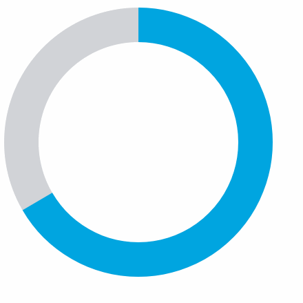
### 9.2 代码
```html
<svg width="440" height="440" viewBox="0 0 440 440">
  // 背景圆
  <circle
          cx="220"
          cy="220"
          r="170"
          stroke-width="50"
          stroke="#D1D3D7"
          fill="none"></circle>
  // 蓝色圆 
  <circle
          className="circle"
          cx="220"
          cy="220"
          r="170"
          stroke-width="50"
          stroke="#00A5E0"
          fill="none"
          // transform="matrix(0,-1,1,0,0,440)"
          />
</svg>
```
```javascript
.circle {
  animation: circle 5s linear infinite;
  transform: rotate(-90deg);
  transform-origin: center;
}

@keyframes circle {
  from {
    stroke-dasharray: 0 1069; // 第一个位置是0，第二个位置是间隔圆的周长，显示空
  }
  to {
    stroke-dasharray: 1069 0;// 第一个位置显示圆的周长，也就是满
  }
}
```
### 9.3 知识点-stroke-dasharray
stroke-dasharray用来绘制路径虚线。可以有一个或者多个参数，下面看一下它在不同参数下的效果。

#### 9.3.1 不添加stroke-dasharray属性
```javascript
#rect {
	stroke-width: 6px;
	fill: yellow;
	stroke: red;
	/*stroke-dasharrry:10;*/
}
<svg height="100" width="300">
    <rect id="rect" height="100" width="300" />
</svg>

## 10. logo描边动画
### 10.1 找一个svg图片
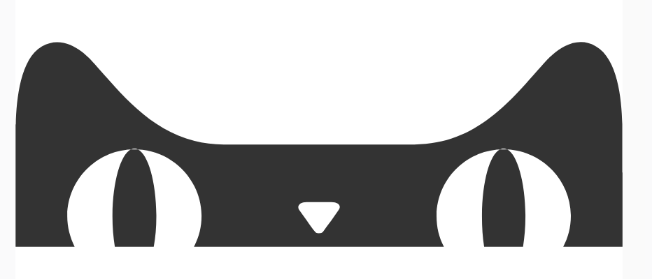
### 10.2 获取path长度
```javascript
const path = document.getElementById('taobao-logo')
const pathLen = path.getTotalLength() // 12202
```
### 10.3 代码
```html
<svg
     className="taobao-path"
     viewBox="0 0 2874 1024"
     version="1.1"
     xmlns="http://www.w3.org/2000/svg"
     p-id="3326"
     width="200"
     height="200"
     >
  <path
        id="taobao-logo"
        d="M2873.45449 645.476966l0 352.017332-280.397667 0c23.53705-44.002202 35.817267-92.097536 35.817267-144.286208 0-168.845517-134.058701-309.03849-300.864614-317.22496-7.163494-3.069952-12.280218-4.093235-17.396941-4.093235-7.163494 0-10.233446 1.023283-17.396941 4.093235-166.805914 8.18647-299.841331 148.379443-299.841331 317.22496 0 52.18857 11.256832 100.284006 34.793882 144.286208l-1182.991617 0c23.53705-44.002202 35.817267-92.097536 35.817267-144.286208 0-168.845517-133.035418-309.03849-300.864614-317.22496-5.116723-3.069952-9.210163-4.093235-16.373555-4.093235-5.116723 0-10.233446 1.023283-17.396941 4.093235-166.805914 8.18647-300.864614 148.379443-300.864614 317.22496 0 52.18857 13.303501 100.284006 34.793882 144.286208l-279.374318 0 0-352.017332 0-218.987526 0-1.023306c0-5.116518 0-8.18647 1.023386-9.209754 3.070054-121.773466 22.513664-312.108442 123.825254-369.41353 116.66176-66.514944 224.113459 54.235238 245.60384 79.817933 152.479027 170.892186 316.214886 385.78647 615.032832 385.78647l70.611091 0 379.662535 0 1.023349 0 378.639185 0 71.63444 0c297.79456 0 462.553805-214.894285 614.009446-385.78647 20.466995-23.536026 130.988646-148.379443 245.60384-79.817933 102.334874 58.328474 121.778586 246.616781 124.84864 369.41353l0 9.209756 0 1.023306 0 218.987526L2873.454481 645.476969zM1527.750349 826.602189c17.396941-21.489459 4.09344-40.93225-31.723827-40.93225l-117.685152 0c-33.770496 0-49.120768 19.44279-32.747213 40.93225l33.770496 47.072051c13.303501 19.44279 27.630387 39.908966 38.887219 53.211955 3.070054 3.069952 5.116723 7.163187 18.420326 7.163187s16.373555-4.093235 19.44361-7.163187c9.210163-13.302989 23.53705-33.769062 38.887219-53.211955L1527.750349 826.602189zM564.778701 535.983206l15.350237 0c49.120768 24.559309 86.984704 157.589197 86.984704 318.248243 0 52.18857-4.09344 100.284006-12.280218 143.262822l-184.202847 0c-7.163494-44.002202-11.256832-91.074253-11.256832-143.262822 0-160.659046 37.863936-293.688832 86.984704-318.248243L564.778798 535.983206zM2310.61248 535.983206l17.396936 0c48.097382 24.559309 85.961318 158.61248 85.961318 318.248243 0 52.18857-4.09344 99.260723-11.256832 143.262822l-184.202847 0c-7.163494-44.002202-10.233446-91.074253-10.233446-143.262822 0-160.659046 35.817267-293.688832 84.937933-318.248243L2310.612448 535.983206z"
        p-id="3327"
        >
  </path>
</svg>
```
```css
.taobao-path {
  animation: taobao 10s linear infinite forwards;
  stroke: #333;
  stroke-width: 10;
}
@keyframes taobao {
  from {
    stroke-dasharray: 12203;
    stroke-dashoffset: 12203;
    fill: none;
  }
  to {
    stroke-dasharray: 12203;
    stroke-dashoffset: 0;
    fill: #333;
  }
}
```
> animation-fill-mode（动画填充模式），定义动画播放时间之外的状态

- （1）none，播放完之后不改变默认行为，默认值
- （2）forwards则是停在动画最后的的那个画面
- （3）backwards则是回调到动画最开始出现的画面
- （4）both则应用为动画结束或开始的状态
### 10.4 效果
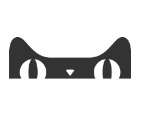

## 11. SMIL
[SMIL](https://www.w3.org/TR/REC-smil/)全称 Synchronized Multimedia Integration Language，它允许我们通过 HTML 标签实现动画效果，它可以用于：

- 实现过渡动画
- 实现补间动画
- 动画颜色变换
- 路径运动动画（CSS3无法实现）
> SMIL 包含以下标签

```html
<set>
<animate>
<animateColor>
<animateTransform>
<animateMotion>
```
> SMIL 兼容性：[查看](https://caniuse.com/#search=SMIL)

### 11.1 为什么要用 SMIL？
实现动画的全新方式：

- 无需 CSS
- 无需 JS
- 几个标签轻松实现复杂动画，它不香吗？
### 11.2 set 标签
实现属性的延迟设置
```html
<svg width="400" height="400">
  <rect x="0" y="0" width="100" height="100" fill="red">
    <set attributeName="x" attributeType="XML" to="10" begin="1s" />
    <set attributeName="x" attributeType="XML" to="20" begin="2s" />
    <set attributeName="x" attributeType="XML" to="30" begin="3s" />
    <set attributeName="x" attributeType="XML" to="40" begin="4s" />
    <set attributeName="x" attributeType="XML" to="50" begin="5s" />
  </rect>
</svg>
```
### 11.3 animation 标签
案例一：移动的小球
> 效果

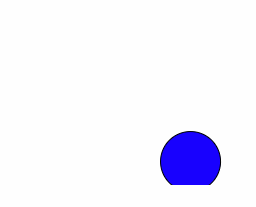
> 代码

```html
<svg width="500" height="200" viewBox="0 0 500 200">
  <circle cx="0" cy="0" r="30" fill="blue" stroke="black" stroke-width="1">
    <animate attributeName="cx" from="0" to="200" dur="5s" repeatCount="indefinite" />
    <animate attributeName="cy" from="0" to="200" dur="5s" repeatCount="indefinite" />
  </circle>
</svg>
```
案例二：形状补间动画
> 效果

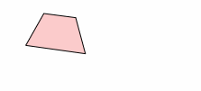
> 代码

```html
<svg width="400" height="400">
  <polygon points="30 30 70 30 90 70 10 70" fill="#fcc" stroke="black">
    <animate attributeName="points" attributeType="XML" to="50 30 70 50 50 90 30 50" dur="5s" fill="freeze" repeatCount="1" />
  </polygon>
</svg>
```
> - fill 属性：freeze 和 remove，前者保持最后的形状，后者恢复到之前的形状

### 11.4 animationColor 标签
已废弃，通过 animation 可实现同样效果
```html
<svg width="200" height="200" viewBox="0 0 200 200">
  <rect x="0" y="0" width="100" height="50" fill="red">
    <animate attributeName="fill" from="red" to="blue" dur="5s" repeatCount="indefinite"></animate>
  </rect>
</svg>
```
### 11.5 animateTransform 标签
```html
<svg width="200" height="200" viewBox="0 0 200 200">
  <rect x="0" y="0" width="60" height="60" fill="red">
    <animateTransform attributeName="transform" begin="0s" dur="3s" type="scale" from="1" to="2" repeatCount="indefinite" />
  </rect>
</svg>
```
### 11.6 animateMotion 标签 
`<animateMotion>` 元素定义了一个元素如何沿着运动路径进行移动。

实现细节：

- rotate: auto -> 0 可以更加流畅，默认auto，不运动不旋转，改成0更流畅。
- begin: 可填入多个值，支持表达式。
- 多个 animateMotion 并行时，后者会覆盖前者
- path 用法：[查看](https://www.w3school.com.cn/svg/svg_path.asp)

### 11.7 案例一：按 path 轨迹运动的正方形
> 效果

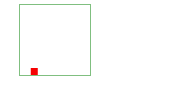
> 代码

```html
<svg width="200" height="200" viewBox="0 0 200 200">
  <rect x="0" y="0" width="10" height="10" fill="red">
    <animateMotion
      path="M 10 10 L 110 10 L 110 110 L 10 110 Z"
      dur="5s"
      rotate="auto"
      fill="freeze"
      repeatCount="indefinite"
    />
  </rect>
  <path id="motion-path" d="M 10 10 L 110 10 L 110 110 L 10 110 Z" fill="none" stroke="green" />
</svg>
```
### 11.8 案例二：混合动画
> 效果

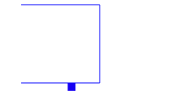
> 代码

```html
<svg viewBox="0 0 200 200" width="200" height="200">
    <rect x="0" y="0" rx="0" ry="0" width="10" height="10" fill="red">
      <animateMotion
        id="forward-rect"
        path="M 10 10 L 110 10 L 110 110 L 10 110"
        dur="2s"
        rotate="0"
        fill="freeze"
        begin="0; backward-rect.end + 0.5s"
      />
      <animateMotion
        id="backward-rect"
        path="M 10 110 L 110 110 L 110 10 L 10 10"
        dur="2s"
        rotate="0"
        fill="freeze"
        begin="forward-rect.end + 0.5s"
      />
      <animate
        id="red-to-blue"
        attributeType="XML"
        attributeName="fill"
        begin="0; blue-to-red.end + 1s"
        from="red"
        to="blue"
        dur="2s"
        fill="freeze"
      />
      <animate
        id="blue-to-red"
        attributeType="XML"
        attributeName="fill"
        begin="red-to-blue.end + 1s"
        from="blue"
        to="red"
        dur="2s"
        fill="freeze"
      />
    </rect>
    <path d="M 10 10 L 110 10 L 110 110 L 10 110" fill="none" stroke-width="1" stroke="blue"/>
</svg>
```
### 11.9 案例三：点击变色或位移
> 效果

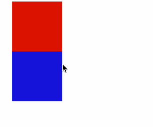
> 代码

```html
<svg viewBox="0 0 200 200" width="200" height="200">
    <g id="rect1">
      <rect x="0" y="0" rx="0" ry="0" width="100" height="100" fill="red">
        <animate
          attributeType="XML"
          attributeName="fill"
          from="red"
          to="green"
          begin="rect1.click"
          dur="2s"
          fill="freeze"
        />
      </rect>
    </g>
    <animateTransform
      attributeType="XML"
      attributeName="transform"
      type="translate"
      from="0, 0"
      to="50, 50"
      begin="rect1.click"
      dur="2s"
      fill="freeze"
    />
    <rect x="0" y="100" width="100" height="100" fill="blue">
      <animate
        attributeType="XML"
        attributeName="fill"
        from="blue"
        to="green"
        begin="rect1.click"
        dur="2s"
        fill="freeze"
      />
    </rect>
</svg>
```
