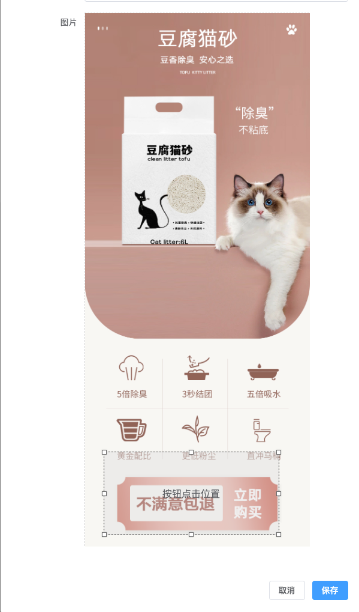

# 2022-11-vue-drag-resize

## 1. 场景需求


用户上传一张图片，需要做一个蒙版模块，支持拖拽和缩放，定义出一个点击位置。当用户点击蒙版位置的时候，做跳转页面。
## 2. vue-drag-resize
[https://codesandbox.io/examples/package/vue-drag-resize](https://codesandbox.io/examples/package/vue-drag-resize)
[https://github.com/kirillmurashov/vue-drag-resize](https://github.com/kirillmurashov/vue-drag-resize)
需要注意的是，vue3要特殊处理：

- 安装next版本：yarn add vue-drag-resize@next
- 引入的时候：
```html
// demo.vue
<script setup lang="ts">
    import VueDragResize from 'vue-drag-resize/src/component/vue-drag-resize.vue';
</script >

<template>
    <VueDragResize :w="200"  :h="120" >
        Hello World
    </VueDragResize>
</template>
```
## 3. 示例代码
```html
<template>
  <el-dialog
    @close="handleCancel"
    v-model="visible"
    title="新建落地页"
    width="600px"
    draggable
  >
    <div>
      <el-form
        ref="ruleFormRef"
        :model="ruleForm"
        label-width="120px"
        status-icon
      >
        <el-form-item label="图片" prop="file">
          <div v-if="ruleForm.file">
            <div class="uploadWrap" :style="{ height: `${parentHeight}px` }">
              
              <VueDragResize
                class="drag-item"
                :isActive="true"
                :isDraggable="true"
                :parentW="375"
                :parentH="parentHeight"
                :parentLimitation="true"
                :w="width"
                :h="height"
                v-on:resizing="resize"
                v-on:dragging="resize"
              >
                <div class="tip">按钮点击位置</div>
              </VueDragResize>
            </div>
          </div>
          <div v-else class="uploadWrap">
            <el-upload
              class="uploader"
              :http-request="handleUpload"
              :show-file-list="false"
              :on-success="handleAvatarSuccess"
            >
              <el-icon class="uploader-icon">
                <Plus />
                <span class="text">选择图片</span>
              </el-icon>
            </el-upload>
          </div>
        </el-form-item>
      </el-form>
    </div>
  </el-dialog>
</template>

<script lang="ts" setup>
import { ref, watch } from "vue";
import VueDragResize from "vue-drag-resize/src/component/vue-drag-resize.vue";

const props = defineProps({
  dialogVisible: Boolean,
});

const emits = defineEmits(["updateDialogVisible"]);

const ruleForm = ref<any>({ file: null });

// 这四个是vue-drag-resize需要的变量
const width = ref(375);
const height = ref(200);
const top = ref(0);
const left = ref(0);
// 父组件高度，选了图片需要重新设置高度
const parentHeight = ref(667);
const visible = ref(false);

watch(
  () => props.dialogVisible,
  (newValue) => {
    visible.value = newValue;
  },
  { immediate: true }
);

const handleCancel = () => {
  emits("updateDialogVisible", false);
};
  
const handleOk = () => {
  emits("updateDialogVisible", false);
};
  
const handleAvatarSuccess = () => {};

// 自定义上传函数  
const handleUpload = (params: any) => {
  const url = URL.createObjectURL(params.file);
  var reader = new FileReader();
  reader.readAsDataURL(params.file);
  reader.onload = function (evt: any) {
    var replaceSrc = evt.target.result;
    var imageObj = new Image();
    imageObj.src = replaceSrc;
    imageObj.onload = function () {
      // 取图片宽高
      parentHeight.value = (375 * imageObj.height) / imageObj.width;
    };
  };
  ruleForm.value.file = url;
  return Promise.resolve(() => {});
};
// vue-drag-resize的回调函数  
const resize = (newRect: any) => {
  width.value = newRect.width;
  height.value = newRect.height;
  top.value = newRect.top;
  left.value = newRect.left;
};
</script>

```
## 4. vue-drag-resize的Props说明

- isActive：是否可用
- isDraggable: 是否可拖拽
- parentW: 可拖拽的容器宽度
- parentH: 可拖拽的容器高度
- parentLimitation: 是否做父容器的宽高限制
- w：拖拽模块的宽度
- h：拖拽模块的高度
- x:  拖拽模块默认的左边距
- y: 拖拽模块模块的上边距
-  v-on:resizing="resize"：缩放后的回调
- v-on:dragging="resize"：拖拽后的回调
## 5. h5页面的位置适配
上面是管理后台做的配置，蒙版模块是按照375的宽度做的位置记录，而h5页面的宽度是不固定的，蒙版的位置属性需要根据实际宽度做计算。
```javascript
const config = {
  imgOriginWidth: Number("790"),
  imgOriginHeight: Number("1871"),
  imgWidth: Number("375"),
  imgHeight: Number("888"),
  btnWidth: Number("105"),
  btnHeight: Number("86"),
  btnTop: Number("660"),
  btnLeft: Number("130"),
};
const hwScale = config.imgHeight / config.imgWidth;
let screenWidth = window.innerWidth;
screenWidth = screenWidth > 700 ? 700 : screenWidth;
// 计算一个比例，注意别写反了
const widthScale = screenWidth / config.imgWidth;
// 设置图片宽高
img.style.width = `${screenWidth}px`;
const imgHeight = hwScale * screenWidth;
img.style.height = `${imgHeight}px`;

// 设置点击区域
btn.style.height = `${config.btnHeight * widthScale}px`;
btn.style.width = `${config.btnWidth * widthScale}px`;
btn.style.left = `${config.btnLeft * widthScale}px`;
btn.style.top = `${config.btnTop * widthScale}px`;
```
