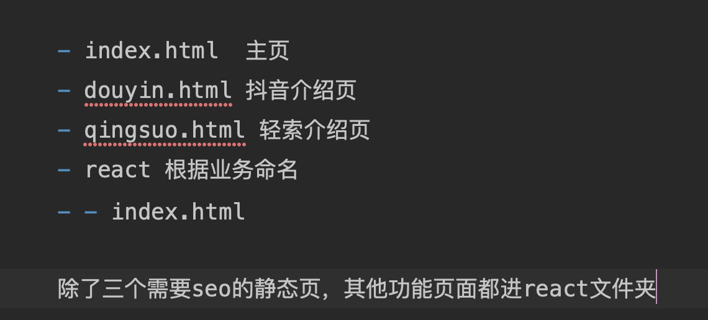
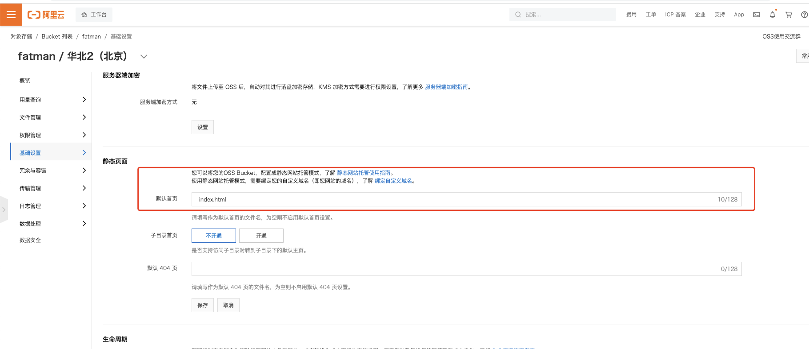

# 2022-11-一次官网开发的技术选型调研

## 1. 场景需求
公司官网，首页和介绍页需要seo，其他页面不需要，但有业务功能。

## 2. 技术方案

- ssr
- 静态页面
- 静态页面+React
## 3. ssr被pass的原因
ssr本质就是起一个node服务，然后这个node服务返回带dom结构的html。

react提供了把虚拟dom转化成dom字符串的功能，node服务再把dom字符串返回给页面。
```
// ES modules
import ReactDOMServer from 'react-dom/server';

ReactDOMServer.renderToString(element)
```

缺点就是需要服务器起一个服务，占用服务器资源，当网站需要大规模推广的时候，服务端承受的压力较大。
## 4. 静态页面被pass的原因
开发麻烦

## 5. 静态页面+React的实现
```
import { defineConfig } from 'umi';
import routes from './config/routes';
import theme from './src/theme';
const outputPath = 'dist/react'; // 指定输出路径
const env = process.env.NODE_ENV;
const path = require('path');
export default defineConfig({
  nodeModulesTransform: {
    type: 'none',
  },
  routes: routes,
  fastRefresh: {},
  outputPath,
  publicPath: env === 'development' ? '/' : './',
  hash:true,  //对打包的静态资源随机增加后缀
  title: '轻索',
  dynamicImport: {
    loading: '@/pages/loading',
  },
  antd: {
    compact: true,
  },
  dva: {
    hmr: true, // 表示是否启用 dva model 的热更新
  },
  theme,
  proxy: {
    '/api': {
      'target': '',
      'changeOrigin': true,
      'pathRewrite': { '^/api' : '' },
    },
  },
  ignoreMomentLocale: true, // 忽略 moment 的 locale 文件，用于减少尺寸
  copy:[
    {
      from: 'web',
      to:'../',
    },
  ],
});

```
web文件夹下就是静态页面，最终打包出来的路径就是

## 6. 参考文章

- [react官网-reactDomServer]([https://zh-hans.reactjs.org/docs/react-dom-server.html](https://zh-hans.reactjs.org/docs/react-dom-server.html#rendertostring))
- [一文吃透 React SSR 服务端渲染和同构原理 ]([https://juejin.cn/post/6844903943902855176#heading-4](https://juejin.cn/post/6844903943902855176#heading-4))
## 7. 遗留问题
> localhost:8000  --- 访问index.html没问题
> localhost:8000/douyin.html --- 访问douyin.html没问题
> localhost:8000/qingsuo.html --- 访问qingsuo.html没问题
> localhost:8000/react --- 不会到react/index.html
> localhost:8000/react/index.html --- 才会访问react/index.html
> localhost:8000/react/todo --- 也不会到react/index.html

需要SRE配置`/react/*`全部指向`/react/index.html`

## 8. 遗留问题解决
上面的问题，只是在测试环境中有问题，我本地采取了两种静态服务器去查看问题，发现都是正常的。

### 8.1 nginx


### 8.2 http-server
```
- cd dist
- http-server
```
### 8.3 生产环境增加oss配置
oss不支持应该是oss必须加什么设置，最后联系SRE，生产环境因为是单独的桶，所以可以单独设置支持子目录如下：


### 8.4 测试环境的配置
测试环境是整个公司都公用一个桶，所以不方便做这些统一的设置，这里采取路径指向的设置

