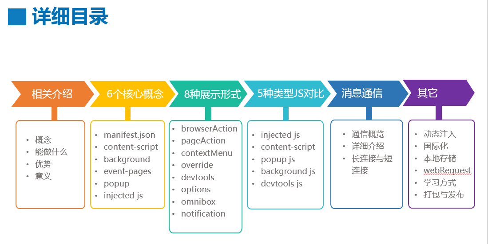
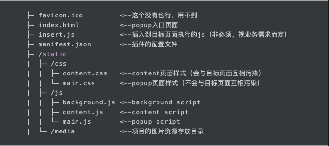
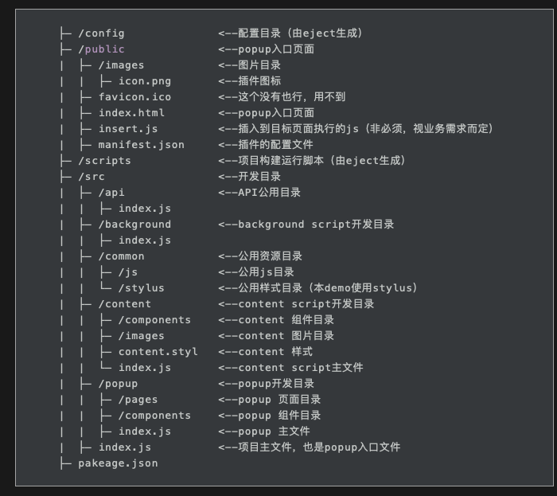
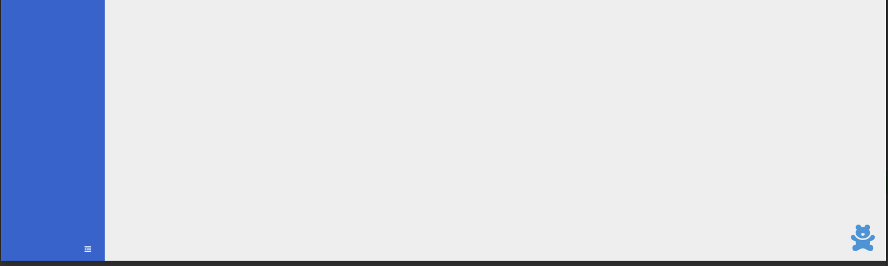
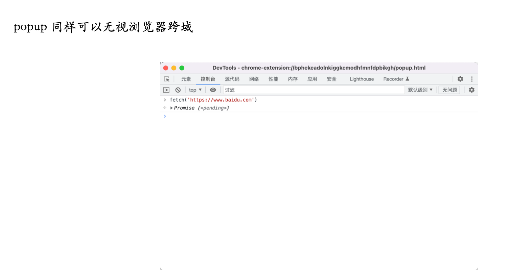
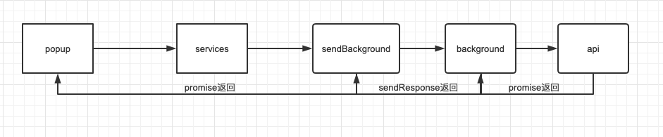

# 2022-12-React+Antd去写chrome插件

## 1. 需求场景
做浏览器插件，有以下几个问题

- popup.html和content插入页面的dom可能很复杂，用原生去写很吃力，可维护性差。
- 交付客户的时候js要压缩，不然明码的东西没有技术壁垒。

而解决以上两个问题的一个很好的方式就是用React或者Vue去写，这里只讨论React.
## 2. chrome插件介绍
> [https://www.bookstack.cn/read/chrome-plugin-develop/spilt.1.8bdb1aac68bbdc44.md](https://www.bookstack.cn/read/chrome-plugin-develop/spilt.1.8bdb1aac68bbdc44.md)


chrome插件支持的功能很多，显示层面上常用的有

- popup: 也就是browserAction和pageAction配置的点击弹出的页面
- content: 插入到页面的dom

这两个用原生去写很复杂，最好使用框架去写。
常用的js有

- popup.js: 弹窗的js，生命周期很端，弹窗消失就结束
- background.js：常驻后台的js，生命周期同浏览器，可跨域请求接口
- content.js：和content的dom一起的js，但是和原页面的js是互相独立的，不能互相调用。
- injected.js：注入到原页面的js，可以和原页面js互相调用。

css的问题：
虽然content.js和原页面js是独立的，但是css是一起的，也就是有互相影响的问题。
## 3. create-react-app创建项目
[https://create-react-app.dev/docs/getting-started#yarn](https://create-react-app.dev/docs/getting-started#yarn)
```tsx
yarn create react-app my-app
```
## 4. react和chrome目录结构规划
### 4.1 chrome插件的目录结构

### 4.2 manifest.json
```tsx
{
  "name": "bear",
  "version": "1.0",
  "description": "React开发chrome插件Demo。",
  // 图标，图省事的话，所有尺寸都用一个图也行
  "icons": {
    "16": "images/icon.png",
    "48": "images/icon.png",
    "128": "images/icon.png"
  },
  // manifest.json的版本，有2和3
  "manifest_version": 2,
  // popup页面配置
  "page_action": {
    // 浏览器插件按钮的图标
    "default_icon": "images/icon.png",
    // 浏览器插件按钮hover显示的文字
    "default_title": "bear",
    // popup页面的路径(根目录为最终build生成的插件包目录)
    "default_popup": "index.html"
  },
  // background script配置
  "background": {
    // background script路径(根目录为最终build生成的插件包目录)
    "scripts": [
      "static/js/background.js"
    ],
    // 官方建议这里为false
    "persistent": false
  },
  // content script配置
  "content_scripts": [
    {
      // 应用于哪些页面地址(可以使用正则，<all_urls>表示匹配所有地址)
      "matches": [
        "<all_urls>"
      ],
      // 注入css，注意不要污染样式
      "css": [
        "static/css/content.css"
      ],
      // 注入的js
      "js": [
        "static/js/content.js"
      ],
      // 代码注入的时间，可选document_start/document_end/document_idle(默认)
      "run_at": "document_end"
    }
  ],
  // 权限申请（需要background发起跨域请求的url也放在这里）
  "permissions": [
    // 标签
    "tabs",
    // 根据定制的网页规则，采取相应的错误(例如只在baidu.com启动组件)
    "declarativeContent",
    // 插件本地存储
    "storage",
    // 通知
    "notifications"
  ],
  // 如果向目标页面插入js，需要在这里声明下才能获得执行的权限
  "web_accessible_resources": ["insert.js"]
}

```
### 4.3 react的目录结构

## 5. webpack的调整
### 5.1 create-react-app调整webpack的几种方式

- npm run eject： 弹窗配置后修改
- 通过 CRA 官方支持的 --scripts-version 参数，创建项目时使用自己重写过的 react-scripts 包
- 使用 [react-app-rewired](https://link.juejin.cn?target=https%3A%2F%2Fgithub.com%2Ftimarney%2Freact-app-rewired) + [customize-cra](https://link.juejin.cn?target=https%3A%2F%2Fgithub.com%2Farackaf%2Fcustomize-cra) 组合覆盖配置
- 使用 [craco](https://link.juejin.cn?target=https%3A%2F%2Fgithub.com%2Fgsoft-inc%2Fcraco) 覆盖配置
> eject 是不可逆操作，弹出配置后，你将无法跟随官方的脚步去升级项目的 react-script 版本。
> 不用ejct只能用后面三种，antd也推荐使用craco，这里也用第三种

### 5.2 craco基本配置
安装
```tsx
yarn add @craco/craco
```
项目根目录创建 craco.config.js 文件
```tsx
/* craco.config.js */

module.exports = {
  ...
}
```
修改 package.json 的 scripts 命令
```tsx
/* package.json */

"scripts": {
-   "start": "react-scripts start",
+   "start": "craco start",
-   "build": "react-scripts build",
+   "build": "craco build"
-   "test": "react-scripts test",
+   "test": "craco test"
}
```
### 5.3 多页面打包
根据我们预想的目录结构，popup/content/background必须打出三个js，我们需要修改webpack的entry
```tsx
module.exports = {
  webpack: {
    /**
     * 重写 webpack 任意配置
     *  - 与直接定义 configure 对象方式互斥
     *  - 几乎所有的 webpack 配置均可以在 configure 函数中读取，然后覆盖
     */
    configure: (webpackConfig, { env, paths }) => {
      // 修改entry
      webpackConfig.entry = {
        main: './src/index.js',
        content: './src/content/index.js',
        background: './src/background/index.js',
      };
      return webpackConfig;
    },
  }
}
```
这样打出的三个js

- build/static/js/main.e727f872.js
- build/static/js/background.31d6cfe0.js
- build/static/js/content.31d6cfe0.js
### 5.4 去掉js的hash
```tsx
// 修改output
webpackConfig.output = {
  ...webpackConfig.output,
  ...{
    filename: 'static/js/[name].js',
    chunkFilename: 'static/js/[name].js',
  },
}
```
### 5.5 	去掉css的hash
```tsx
yarn add -D mini-css-extract-plugin
```
```tsx
const MiniCssExtractPlugin = require('mini-css-extract-plugin');

// 覆盖已经内置的 plugin 配置
webpackConfig.plugins.map((plugin) => {
  if (plugin instanceof MiniCssExtractPlugin) {
    Object.assign(plugin.options, {
      filename: 'static/css/[name].css',
      chunkFilename: 'static/css/[name].css',
    })
  }
  return plugin
})
```
### 5.6 less支持
安装依赖
```tsx
yarn add craco-less
```
配置文件
```tsx
const CracoLessPlugin = require('craco-less');

module.exports = {
  webpack: {},
  // craco 提供的插件
  plugins: [
    {
      // 配置 less
      plugin: CracoLessPlugin,
      options: {
        lessLoaderOptions: {
          lessOptions: {
            modifyVars: {
              // 自定义主题（如果有需要，单独文件定义更好一些）
              '@primary-color': '#1DA57A',
            },
            javascriptEnabled: true,
          },
        },
      },
    },
  ]
}

```
页面中使用
```tsx
import "./index.less";

export default function Popup() {
  return (
    <div className="container" style={{ background: 'lightblue' }}>popup</div>
  )
}
```
> 但是不支持下面的css module写法

```tsx
import styles from "./index.less";

export default function Popup() {
  return (
    <div className={styles.container} style={{ background: 'lightblue' }}>popup</div>
  )
}
```
### 5.7 支持css module
配置文件
```tsx
const { loaderByName } = require('@craco/craco');
const lessModuleRegex = /\.less$/;

// craco 提供的插件
plugins: [
  {
    plugin: CracoLessPlugin,
    options: {
      // less loader option
      lessLoaderOptions: {
        lessOptions: {
          /*
              如果项目中有使用TDesign或AntDesign组件库需要自定义主题，可以在modifyVars中添加对应less变量
          */
          modifyVars: {
            "@primary-color": '#2378ff'
          },
          javascriptEnabled: true,
        },
      },
      modifyLessRule(lessRule) {
        lessRule.exclude = lessModuleRegex;
        return lessRule;
      },
      modifyLessModuleRule(lessModuleRule) {
        // configure the file suffix
        lessModuleRule.test = lessModuleRegex;

        // configure the generated local ident name
        const cssLoader = lessModuleRule.use.find(loaderByName('css-loader'));
        cssLoader.options.modules = {
          /* 
              注意这里的命名规则：
              - CRA脚手架创建的项目是可以直接使用css modules的，css文件的命名规则默认是[local]_[hash:base64:5]
              - 这里使用css modules的命名规则
          */

          localIdentName: '[local]_[hash:base64:5]',
        };

        return lessModuleRule;
      },
    },
  },
],
```
代码
```tsx
import styles from "./index.less";

export default function Popup() {
  return (
    <div className={styles.container}>popup</div>
  )
}
```
### 5.8 设置popup只引入自己的index.js
现在有一个现象
popup中的代码
```tsx
import styles from "./index.less";

export default function Popup() {
  return (
    <div className={styles.container}>popup</div>
  )
}
```
```tsx
.container{
  color: red;
}
```
content中的代码
```tsx
import "./index.less";

export default function Content() {
  return (
    <div>Content</div>
  )
}
```
```tsx
div {
  background: lightblue;
}
```
然后发现popup中的字体颜色被影响了。原因就是popup.html里面有popup.js和content.js，这里要实现各个页面引用自己的js.
这个问题需要修改htmlwebpackplugin
```tsx
webpackConfig.plugins.map((plugin) => {
  if(plugin instanceof HtmlWebpackPlugin){
    Object.assign(plugin.userOptions, {
      chunks: ['main'],
    })
  }
  return plugin
})
```
## 6. popup跑起来
这个时候，运行build命令打出的包，加载到浏览器后，无法展示popup页面，因为background还要加东西
```tsx
/*global chrome*/
chrome.runtime.onInstalled.addListener(function () {
  chrome.declarativeContent.onPageChanged.removeRules(undefined, function () {
    chrome.declarativeContent.onPageChanged.addRules([{
      // 运行插件运行的页面URL规则
      conditions: [
        new chrome.declarativeContent.PageStateMatcher({ pageUrl: {} }),
      ],
      actions: [new window.chrome.declarativeContent.ShowPageAction()]
    }])
  })
})
```
这样就可以跑起来了。
## 7. popup使用antd
安装依赖
```tsx
yarn add antd
// 实现antd的按需加载
yarn add -D babel-plugin-import
```
修改package.json
```tsx
"babel": {
  "presets": [
    "react-app"
  ],
  "plugins": [
    [
      "import",
      {
        "libraryName": "antd",
        "style": "css"
      }
    ]
  ]
}
```
使用
```tsx
import { Button, Tag } from "antd";
import styles from "./index.less";
import 'antd/dist/antd.css';

export default function Popup() {
  return (
    <div className={styles.container}>
      <Button type="primary">popup</Button>
      <Tag color="magenta">magenta</Tag>
      <Tag color="red">red</Tag>
      <Tag color="volcano">volcano</Tag>
      <Tag color="orange">orange</Tag>
      <Tag color="gold">gold</Tag>
      <Tag color="lime">lime</Tag>
      <Tag color="green">green</Tag>
      <Tag color="cyan">cyan</Tag>
      <Tag color="blue">blue</Tag>
      <Tag color="geekblue">geekblue</Tag>
      <Tag color="purple">purple</Tag>
    </div>
  );
}
```
## 8. content基本实现
```tsx
import React, { useState } from 'react'
import ReactDOM from 'react-dom'
import styles from './index.less'

function Content() {
  return (
    <div className={styles.content}>
      <div
        className={styles.entry}
      ></div>
    </div>
  )
}

const app = document.createElement('div')
app.id = 'bear-container'
document.body.appendChild(app)

ReactDOM.render(<Content />, app)

try {
  let insertScript = document.createElement('script')
  insertScript.setAttribute('type', 'text/javascript')
  insertScript.src = window.chrome.extension.getURL('insert.js')
  document.body.appendChild(insertScript)
} catch (err) { }

```
```tsx
.content {
  .entry {
    position: fixed;
    bottom: 20px;
    right: 20px;
    width: 50px;
    height: 50px;
    background: url("images/icon.png");
    background-size: 100% 100%;
    cursor: pointer;
  }
}
```
打开某个页面刷新就可以看的右下角有个小熊

## 9. content使用antd
引入antd的样式
```tsx
import React, { useState } from 'react'
import ReactDOM from 'react-dom'
import styles from './index.less'
import TableDrawer from "./components/table-drawer";
import "antd/dist/antd.css";

function Content() {
  const [mainModalVisiable, setMainModalVisiable] = useState(false)

  return (
    <div className={styles.content}>
      <div
        className={styles.entry}
        onClick={() => {
          setMainModalVisiable(true)
        }}
      ></div>
      <TableDrawer open={mainModalVisiable} onClose={() => setMainModalVisiable(false)} />
    </div>
  )
}

const app = document.createElement('div')
app.id = 'bear-container'
document.body.appendChild(app)

ReactDOM.render(<Content />, app)
```
drawer的代码，使用多个antd组件
```tsx
import React from "react";
import { Drawer, Table, Tag, Space } from "antd";

export default function TableDrawer({ open, onClose }) {
  const columns = [
    {
      title: "Name",
      dataIndex: "name",
      key: "name",
      render: (text) => <a>{text}</a>,
    },
    {
      title: "Age",
      dataIndex: "age",
      key: "age",
    },
    {
      title: "Address",
      dataIndex: "address",
      key: "address",
    },
    {
      title: "Tags",
      key: "tags",
      dataIndex: "tags",
      render: (_, { tags }) => (
        <>
          {tags.map((tag) => {
            let color = tag.length > 5 ? "geekblue" : "green";

            if (tag === "loser") {
              color = "volcano";
            }

            return (
              <Tag color={color} key={tag}>
                {tag.toUpperCase()}
              </Tag>
            );
          })}
        </>
      ),
    },
    {
      title: "Action",
      key: "action",
      render: (_, record) => (
        <Space size="middle">
          <a>Invite {record.name}</a>
          <a>Delete</a>
        </Space>
      ),
    },
  ];
  const data = [
    {
      key: "1",
      name: "John Brown",
      age: 32,
      address: "New York No. 1 Lake Park",
      tags: ["nice", "developer"],
    },
    {
      key: "2",
      name: "Jim Green",
      age: 42,
      address: "London No. 1 Lake Park",
      tags: ["loser"],
    },
    {
      key: "3",
      name: "Joe Black",
      age: 32,
      address: "Sidney No. 1 Lake Park",
      tags: ["cool", "teacher"],
    },
  ];
  return (
    <Drawer
      title="数据列表"
      placement="right"
      onClose={onClose}
      open={open}
      width={800}
      // getContainer={() => document.querySelector("#bear-container")}
    >
      <Table columns={columns} dataSource={data} />
    </Drawer>
  );
}

```
## 10. 解决打包出来的js带着sourcemap的问题
用[create-react-app](https://so.csdn.net/so/search?q=create-react-app&spm=1001.2101.3001.7020) 脚手架创建的react项目，使用npm run build打包后，默认会产生source-map文件，通常项目上线后这种文件是不必要的。
一般情况下设置shouldUseSourceMap为false就行了。
安装依赖
```tsx
yarn add -D cross-env
```
修改package.json
```tsx
"build": "cross-env GENERATE_SOURCEMAP=false && craco build"
```
## 11. http请求
一般的浏览器插件，也就popup/contentjs/background

- contentjs因为是在别人的域名中执行，会有跨域问题
- popup的域名是`chrome-extension://${extension-id}/`，没有跨域问题
- background不会有跨域问题，所以一般会在background中处理所有的http请求，三者通过通信机制通信


而我们可以像一般的项目一样，封装axios，这里要处理两个问题

- 测试环境和正式环境的接口地址不同
- header中带token的问题
### 11.1 环境变量问题
> 参考：[https://www.yuque.com/changkong001/ukdywy/ogxx1b#vN4dR](https://www.yuque.com/changkong001/ukdywy/ogxx1b#vN4dR)

新建`.env`和`.env.development`文件，里面写接口地址
```shell
REACT_APP_API_URL=http://localhost:3001
REACT_APP_API_URL=https://online.com
```
package.json
### 11.2 token问题
token一般会在接口返回的时候存到localstorage，接口请求的时候从localstorage中取出token放到head中。
chrome插件也有自己的本地缓存，这里我们建议使用chrome的。他们的区别如下：

- chrome.storage是针对插件全局的，即使你在background中保存的数据，在content-script也能获取到；
- chrome.storage.sync可以跟随当前登录用户自动同步，这台电脑修改的设置会自动同步到其它电脑，很方便，如果没有登录或者未联网则先保存到本地，等登录了再同步至网络；

需要声明storage权限，有chrome.storage.sync和chrome.storage.local2种方式可供选择，使用示例如下：
```shell
// 读取数据，第一个参数是指定要读取的key以及设置默认值
chrome.storage.sync.get({color: 'red', age: 18}, function(items) {
 console.log(items.color, items.age);
});
// 保存数据
chrome.storage.sync.set({color: 'blue'}, function() {
 console.log('保存成功！');
});
```
### 11.3 axios配置文件
```jsx
import { getLocalToken, setLocalToken } from "./local";
import axios from "axios";

const service = axios.create({
  baseURL: process.env.REACT_APP_API_URL,
});

service.interceptors.request.use(
  async (config) => {
    // Do something before request is sent
    const token = await getLocalToken();
    if (token && config.headers) {
      // eslint-disable-next-line no-param-reassign
      config.headers["eci-access-token"] = token;
    }
    return config;
  },
  (error) => {
    return Promise.reject(error);
  }
);
const withHeaders = [];
service.interceptors.response.use(
  (response) => {
    if (withHeaders.includes(response.config.url)) {
      return response;
    }
    if (response.headers["eci-access-token"]) {
      setLocalToken(response.headers["eci-access-token"]);
    }
    return response.data;
  },
  (error) => {
    return Promise.reject(error);
  }
);

export default service;

```
```jsx
export const setLocalToken = (token) => {
  chrome.storage.sync.set({ token }, (e)=>{
    console.log('设置成功', e);
  });
};

export const getLocalToken = () => {
  return new Promise((resolve) => {
    chrome.storage.sync.get('token', function (items) {
      resolve(items.token);
    });
  })
};

```
### 11.4 定义service和调用接口
```jsx
import axios from "../utils/request";

// 账户密码登录
export const loginByPassword = (data) => {
  return axios.post("/api/ocean/login/login", data);
};

// 账户详情
export const getUserByToken = () => {
  return axios.post("/api/ocean/user/info");
};
```
```jsx
const login = (values) => {
  const { mobile, password } = values;
  // props.history.push('/home')
  loginByPassword({
    mobile, password: md5(password).toString(), licenseAgreementVersion: 'V1.0'
  }).then((res) => {
    console.log(res);
  })
}
```
## 12. 细节问题
### 12.1 设置路径别名
```jsx
import axios from "../utils/request";
改成
import axios from "@/utils/request"
```
我们需要改webpack的alias
```jsx
const path = require('path');
const resolve = dir => path.resolve(__dirname,dir);

module.exports={
  webpack:{
    alias:{
      '@src': resolve('src')
    }
  }
}
```
### 12.2 监听路由变化
本来，react项目必用路由，所以路由的变化可以用react-router的useHistory()去监听，但是react-router-v6版本去掉了useHistory，使得监听路由变的困难起来。
我们的插件没打算使用路由，所以今天react-router的api也不能使用，只能用原生js去监听。
[https://juejin.cn/post/6844903749421367303](https://juejin.cn/post/6844903749421367303)
### 12.3 chrome.storage.sync.set保存的值从哪里查看

### 12.4 cra创建的react项目，如何用start命令跑线上环境？
定义两个配置文件
```jsx
.env.development

REACT_APP_API_URL=https://sth-api.leyanbot.com/eci-ziying-api
```
```jsx
.env.production

REACT_APP_API_URL=111
```
package.json中修改script
```jsx
"build:test": "env-cmd -f .env.development yarn run build",
"build:prd": "env-cmd -f .env.production yarn run build",
"start:test": "env-cmd -f .env.development yarn run start",
"start:prd": "env-cmd -f .env.production yarn run start",
```
## 13. 接口请求放到background
由于background.js是没有跨域问题的，所以这里把所有的请求都放到background中，popup和content.js都通过通信机制调用background的api。
### 13.1 chrome.runtime.sendMessage
[https://developer.mozilla.org/zh-CN/docs/Mozilla/Add-ons/WebExtensions/API/runtime/sendMessage](https://developer.mozilla.org/zh-CN/docs/Mozilla/Add-ons/WebExtensions/API/runtime/sendMessage)
根据给出的参数不同，API 遵循如下规则：

- **只有 1 个参数**：将会被当做 message 发送给自己的扩展。
- **有 2 个参数**： 
   - 若第二个参数符合下面的规则，将会被当做 (message, options)，将消息发送给自己的扩展： 
      1. 一个合法的配置对象（也就是说这个对象只包含 options 参数支持的属性）
      2. null
      3. undefined
   - 否则，将会被当做 (extensionId, message)。消息将会给发送给 extensionId 指定 ID 的扩展
- **有 3 个参数**：将会被当做 (extensionId, message, options). 消息将会给发送给 extensionId 指定 ID 的扩展
### 13.2 popup给backgroundjs发消息
popup发送消息
```jsx
<Button
  onClick={() => {
    window.chrome &&
      window.chrome.runtime.sendMessage(
        {
          title: "小明",
        },
        (result) => {
          console.log(result);
        }
      );
  }}
>
发送消息
</Button>
```
background接收并返回消息
```jsx
chrome.runtime.onMessage.addListener(function (request, sender, sendResponse) {
  sendResponse(rquest.title + ',我收到了你的消息！');
});
```
### 13.3 popup获取background对象
由于popup可以直接拿到backgroundjs对象，可以直接调用background的方法
popup.js代码
```jsx
<Button
  onClick={() => {
    const bg = chrome.extension.getBackgroundPage();
    console.log("调用方法", bg);
    bg.add("小明", (result) => {
      console.log(result);
    });
  }}
>
  调用方法1
</Button>
```
background.js
```jsx
function add(title, cb) {
  console.log(title + '我被调用了');
  cb('我收到消息了');
}
```
### 13.4 content给background发消息
同popup给background通信

- chrome.runtime.sendMessage发消息
- chrome.runtime.onMessage.addListener接收消息
### 13.5 background或者popup主动给content发消息
popup发送消息

- 首先要找到当前的tab
- 用tab发送消息
```jsx
function sendMessageToContentScript(message, callback)
{
   chrome.tabs.query({active: true, currentWindow: true}, function(tabs)
   {
     chrome.tabs.sendMessage(tabs[0].id, message, function(response)
     {
       if(callback) callback(response);
     });
   });
}
sendMessageToContentScript({cmd:'test', value:'你好，我是popup！'}, function(response)
{
 console.log('来自content的回复：'+response);
});
```
content接收消息同上，chrome.runtime.onMessage.addListener
### 13.6 重新整理request和background
这里调整下代码，popup和content中写页面调接口的时候发消息给background，background发送请求，并把返回值给popup和content.

## 14. 页面和插件通信
实际项目中，插件要配合页面一起配合行动。当然这里还区分页面是自己的还是别人的，这里先讨论页面是自己的，登录成功后，给插件传递token的情况。
下面是页面和插件的几种通信情况
### 14.1 插件往页面插入dom
插件的content.js可以操作dom，插入一个div，属性上添加插件的版本信息，这样页面就知道是否安装了插件。
```jsx

/** 插入插件版本信息 */
var installNode = document.createElement('div');
installNode.id = 'my-chrome-extension-installed';
installNode.style.display = 'none';
installNode.setAttribute('version', window.chrome.runtime.getManifest().version); // 把版本号放到属性里
installNode.innerText=JSON.stringify({key: 'value'}); // 把通信的data放到标签的html text里面
document.body.appendChild(installNode);
```
content-scripts不能访问绝大部分chrome.xxx.api，除了下面这4种：

- chrome.extension(getURL , inIncognitoContext , lastError , onRequest , sendRequest)
- chrome.i18n
- chrome.runtime(connect , getManifest , getURL , id , onConnect , onMessage , sendMessage)
- chrome.storage

页面中获取dom
```jsx
// page.js，指的是用户网页里面的js
var installNode = document.getElementById(''my-chrome-extension-installed'');
if (installNode) {
  console.log('Chrome extension is installed! Here is the infomation: ' + installNode.innerText);
} else {
  console.log('Chrome extention is not installed yet...');
}
```
## 14.2 自定义事件
```jsx
// content.js
// ...接上面的代码
// 创建一个事件，表示从Chrome发送消息给网页
var eventFromChrome = document.createEvent('Event');
eventFromChrome.initEvent('EventFromChrome', true, true);
// 修改installNode的innerText把需要发送的消息内容放在里面
installNode.innerText = JSON.stringify({type: 'HELLO', msg: 'FMVP is nothing for me'});
// 发出事件
installNode.dispatchEvent(eventFromChrome);
```
```jsx
// page.js
// ...接上面的代码
// 监听installNode的EventFromChrome事件
installNode.addEventListener('EventFromChrome', function() {
  var data = JSON.parse(installNode.innerText);
  console.log(data.msg);
});
```
## 14.3 window.postMessage
和自定义事件相比，window.postMessage更简单
```jsx
// page.js
// 向content.js发送消息，注意这里并非是真正的iframe，所以我们直接拿当前的window发消息
window.postMessage({type:'MsgFromPage', msg: 'Hello, I am page.'}, '*');
```
```jsx
// content.js
window.addEventListener("message", funtion (event) {
  if (event.source != window) {
    return;
  }
  console.log(event.data);
}, false);
```
### 14.4 通过background.js通信
我们知道Chrome插件内部通信，可以用chrome.runtime.sendMessage实现。那么用户网页和Chrome插件之间的通信可以吗？官方也给我们提供了这种方式，但是这里有一点必须注意，这种方法要求我们的Chrome插件的manifest.json文件中必须加下面的配置：
```jsx
"externally_connectable": {
  "matches": ["*://*.example.com/*"]
}
```
**注意：出于安全考虑，这里的matches配置，必须是具体的域名，不可以是通配符。**
配置好了以后，我们可以在用户网页的js代码中直接调用chrome.runtime.sendMessage来发送消息给Chrome插件。
```jsx
// page.js
var targetExtensionId = "asdljiadjasjasdasdada"; // 插件的ID
chrome.runtime.sendMessage(targetExtensionId, {type: 'MsgFromPage', msg: 'Hello, I am page~'}, function(response) {
  console.log(response);
});
```
```jsx
// background.js
chrome.runtime.onMessageExternal.addListener(function(request, sender, sendResponse) {
  // 可以针对sender做一些白名单检查
  // sendResponse返回响应
  if (request.type == 'MsgFromPage') {
    sendResponse({tyep: 'MsgFromChrome', msg: 'Hello, I am chrome extension~'});
  }
});
```
## 15. 目标网站的http拦截
[https://www.yuque.com/changkong001/ukdywy/adxshz](https://www.yuque.com/changkong001/ukdywy/adxshz)
这里已经讨论过怎么做http拦截，这里直接使用
```jsx
// content.js
setTimeout(() => {
  const script = document.createElement('script');
  script.setAttribute('type', 'text/javascript');
  //通过chrome.extension.getURL来获取包内资源的路径。需要在manifest.json文件中设置访问权限web_accessible_resources
  script.setAttribute('src', chrome.extension.getURL('/network.js'));
  document.head.appendChild(script);
});
```
content.js中插入network，这里的network是作为insert.js插入的，需要在manifest.json中做申明
```jsx
"web_accessible_resources": ["insert.js", "network.js"]
```
拿到数据后需要同步给content.js，这里用window.postMessage做通信
```jsx
window.postMessage({ type: 'fillNetwork', data: req_data }, '*');

```
content.js中做接收并且展示
```jsx

useEffect(() => {
  const handle = (event) => {
    if (event.source != window) {
      return;
    }
    if (event.data.type === "fillNetwork") {
      // console.log(event.data.data);
      setData((data) => {
        return [event.data.data, ...data];
      });
    }
  };
  window.addEventListener("message", handle, false);

  return () => {
    window.removeEventListener("message", handle);
  };
}, []);
```
> 补充postMessage的参数说明

otherWindow.postMessage(message, targetOrigin, [transfer]);
## 16. 操作目标网站的dom


## 参考文章


