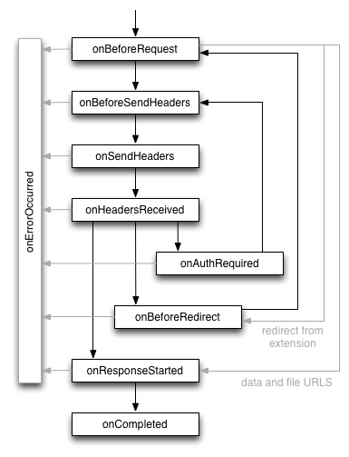
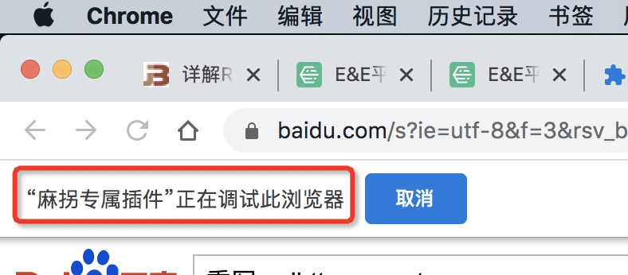

# 2022-12-chrome插件开发拦截http请求的几种方式

## 1. 需求场景
做浏览器插件一般需要拦截http请求，获取请求数据和响应数据。
## 2. chrome插件提供的api
chrome插件有自带的关于http请求的api——[webRequest](https://developer.chrome.com/extensions/webRequest)。

### 2.1 是否显示图片的例子
```tsx
    //manifest.json
    {
     // 权限申请
     "permissions":
     [
     "webRequest", // web请求
     "webRequestBlocking", // 阻塞式web请求
     "storage", // 插件本地存储
     "http://*/*", // 可以通过executeScript或者insertCSS访问的网站
     "https://*/*" // 可以通过executeScript或者insertCSS访问的网站
     ],
    }
    // background.js
    // 是否显示图片
    var showImage;
    chrome.storage.sync.get({showImage: true}, function(items) {
     showImage = items.showImage;
    });
    // web请求监听，最后一个参数表示阻塞式，需单独声明权限：webRequestBlocking
    chrome.webRequest.onBeforeRequest.addListener(details => {
     // cancel 表示取消本次请求
     if(!showImage && details.type == 'image') return {cancel: true};
     // 简单的音视频检测
     // 大部分网站视频的type并不是media，且视频做了防下载处理，所以这里仅仅是为了演示效果，无实际意义
     if(details.type == 'media') {
     chrome.notifications.create(null, {
     type: 'basic',
     iconUrl: 'img/icon.png',
     title: '检测到音视频',
     message: '音视频地址：' + details.url,
     });
     }
    }, {urls: ["<all_urls>"]}, ["blocking"]);
```
### 2.2 其他api
```tsx
// 每次请求前触发，可以拿到 requestBody 数据，同时可以对本次请求作出干预修改
chrome.webRequest.onBeforeRequest.addListener(details => {
 console.log('onBeforeRequest', details);
}, {urls: ['<all_urls>']}, ['blocking', 'extraHeaders', 'requestBody']);
// 发送header之前触发，可以拿到请求headers，也可以添加、修改、删除headers
// 但使用有一定限制，一些特殊头部可能拿不到或者存在特殊情况，详见官网文档
chrome.webRequest.onBeforeSendHeaders.addListener(details => {
 console.log('onBeforeSendHeaders', details);
}, {urls: ['<all_urls>']}, ['blocking', 'extraHeaders', 'requestHeaders']);
// 开始响应触发，可以拿到服务端返回的headers
chrome.webRequest.onResponseStarted.addListener(details => {
 console.log('onResponseStarted', details);
}, {urls: ['<all_urls>']}, ['extraHeaders', 'responseHeaders']);
// 请求完成触发，能拿到的数据和onResponseStarted一样，注意无法拿到responseBody
chrome.webRequest.onCompleted.addListener(details => {
 console.log('onCompleted', details);
}, {urls: ['<all_urls>']}, ['extraHeaders', 'responseHeaders']);
```
### 2.3 不足
chrome.webRequest有个很大的不足就是无法获取到响应数据。
## 3. 其他获取响应数据的方式
上面示例中提到，使用webRequestAPI是无法拿到responseBody的，想要拿到的话只能采取一些变通方法，例如：

1. 重写XmlHttpRequest和fetch，增加自定义拦截事件，缺点是实现方式可能有点脏，重写不好的话可能影响正常页面；
2. devtools的chrome.devtools.network.onRequestFinishedAPI可以拿到返回的body，缺点是必须打开开发者面板；
3. 使用chrome.debugger.sendCommand发送Network.getResponseBody命令来获取body内容，缺点也很明显，会有一个恼人的提示：


devtools和debugger由于有明显的其他东西，所以用的最多的还是重写xmlHttpRequest和fetch.
## 4. 重写fetch和XmlHttpRequest
> 307行中拿到拦截的数据

```tsx
const tool = {
  isString(value) {
    return Object.prototype.toString.call(value) == '[object String]';
  },
  isPlainObject(obj) {
    let hasOwn = Object.prototype.hasOwnProperty;
    // Must be an Object.
    if (!obj || typeof obj !== 'object' || obj.nodeType || isWindow(obj)) {
      return false;
    }
    try {
      if (obj.constructor && !hasOwn.call(obj, 'constructor') && !hasOwn.call(obj.constructor.prototype, 'isPrototypeOf')) {
        return false;
      }
    } catch (e) {
      return false;
    }
    let key;
    for (key in obj) { }
    return key === undefined || hasOwn.call(obj, key);
  }
}

//这个类是基于腾讯开源vconsole（https://github.com/Tencent/vConsole）、写的适用本插件的一个类
class RewriteNetwork {
  constructor() {
    this.reqList = {}; // URL as key, request item as value
    this._open = undefined; // the origin function
    this._send = undefined;
    this._setRequestHeader = undefined;
    this.status = false;
    this.mockAjax();
    this.mockFetch();
  }
  onRemove() {
    if (window.XMLHttpRequest) {
      window.XMLHttpRequest.prototype.open = this._open;
      window.XMLHttpRequest.prototype.send = this._send;
      window.XMLHttpRequest.prototype.setRequestHeader = this._setRequestHeader;
      this._open = undefined;
      this._send = undefined;
      this._setRequestHeader = undefined
    }
  }
  /**
   * mock ajax request
   * @private
   */
  mockAjax() {
    let _XMLHttpRequest = window.XMLHttpRequest;
    if (!_XMLHttpRequest) { return; }
    const that = this;
    //保存原生_XMLHttpRequest方法、用于下方重写
    const _open = window.XMLHttpRequest.prototype.open,
      _send = window.XMLHttpRequest.prototype.send,
      _setRequestHeader = window.XMLHttpRequest.prototype.setRequestHeader;
    that._open = _open;
    that._send = _send;
    that._setRequestHeader = _setRequestHeader;
    //重写设置请求头open
    window.XMLHttpRequest.prototype.open = function () {
      let XMLReq = this;
      let args = [].slice.call(arguments),
        method = args[0],
        url = args[1],
        id = that.getUniqueID();
      let timer = null;

      // may be used by other functions
      XMLReq._requestID = id;
      XMLReq._method = method;
      XMLReq._url = url;

      // mock onreadystatechange
      let _onreadystatechange = XMLReq.onreadystatechange || function () { };
      //定时轮询去查看状态 每次 readyState 属性改变的时候调用的事件句柄函数。当 readyState 为 3 时，它也可能调用多次。
      let onreadystatechange = function () {
        let item = that.reqList[id] || {};

        //恢复初始化
        item.readyState = XMLReq.readyState;
        item.status = 0;
        //同步XMLReq状态
        if (XMLReq.readyState > 1) {
          item.status = XMLReq.status;
        }
        item.responseType = XMLReq.responseType;
        //初始化状态。XMLHttpRequest 对象已创建或已被 abort() 方法重置。
        if (XMLReq.readyState == 0) {
          if (!item.startTime) {
            item.startTime = (+new Date());
          }
          //open() 方法已调用，但是 send() 方法未调用。请求还没有被发送
        } else if (XMLReq.readyState == 1) {
          if (!item.startTime) {
            item.startTime = (+new Date());
          }
          //Send() 方法已调用，HTTP 请求已发送到 Web 服务器。未接收到响应。
        } else if (XMLReq.readyState == 2) {
          // HEADERS_RECEIVED
          item.header = {};
          let header = XMLReq.getAllResponseHeaders() || '',
            headerArr = header.split("\n");
          // extract plain text to key-value format
          for (let i = 0; i < headerArr.length; i++) {
            let line = headerArr[i];
            if (!line) { continue; }
            let arr = line.split(': ');
            let key = arr[0],
              value = arr.slice(1).join(': ');
            item.header[key] = value;
          }
          //所有响应头部都已经接收到。响应体开始接收但未完成
        } else if (XMLReq.readyState == 3) {
          //HTTP 响应已经完全接收。
        } else if (XMLReq.readyState == 4) {
          clearInterval(timer);
          item.endTime = +new Date(),
            item.costTime = item.endTime - (item.startTime || item.endTime);
          item.response = XMLReq.response;
          item.method = XMLReq._method;
          item.url = XMLReq._url;
          item.req_type = 'xml';
          item.getData = XMLReq.getData;
          item.postData = XMLReq.postData;
          that.filterData(item)
        } else {
          clearInterval(timer);
        }
        return _onreadystatechange.apply(XMLReq, arguments);
      };
      XMLReq.onreadystatechange = onreadystatechange;

      //轮询查询状态
      let preState = -1;
      timer = setInterval(function () {
        if (preState != XMLReq.readyState) {
          preState = XMLReq.readyState;
          onreadystatechange.call(XMLReq);
        }
      }, 10);

      return _open.apply(XMLReq, args);
    };

    // 重写设置请求头setRequestHeader
    window.XMLHttpRequest.prototype.setRequestHeader = function () {
      const XMLReq = this;
      const args = [].slice.call(arguments);

      const item = that.reqList[XMLReq._requestID];
      if (item) {
        if (!item.requestHeader) { item.requestHeader = {}; }
        item.requestHeader[args[0]] = args[1];
      }
      return _setRequestHeader.apply(XMLReq, args);
    };

    // 重写send
    window.XMLHttpRequest.prototype.send = function () {
      let XMLReq = this;
      let args = [].slice.call(arguments),
        data = args[0];

      let item = that.reqList[XMLReq._requestID] || {};
      item.method = XMLReq._method ? XMLReq._method.toUpperCase() : 'GET';

      let query = XMLReq._url ? XMLReq._url.split('?') : []; // a.php?b=c&d=?e => ['a.php', 'b=c&d=', 'e']
      item.url = XMLReq._url || '';
      item.name = query.shift() || ''; // => ['b=c&d=', 'e']
      item.name = item.name.replace(new RegExp('[/]*$'), '').split('/').pop() || '';

      if (query.length > 0) {
        item.name += '?' + query;
        item.getData = {};
        query = query.join('?'); // => 'b=c&d=?e'
        query = query.split('&'); // => ['b=c', 'd=?e']
        for (let q of query) {
          q = q.split('=');
          item.getData[q[0]] = decodeURIComponent(q[1]);
        }
      }
      if (item.method == 'POST') {
        // save POST data
        if (tool.isString(data)) {
          let arr = data.split('&');
          item.postData = {};
          for (let q of arr) {
            q = q.split('=');
            item.postData[q[0]] = q[1];
          }
        } else if (tool.isPlainObject(data)) {
          item.postData = data;
        } else {
          item.postData = '[object Object]';
        }

      }
      XMLReq.getData = item.getData || "";
      XMLReq.postData = item.postData || "";
      return _send.apply(XMLReq, args);
    };

  };

  /**
   * mock fetch request
   * @private
   */
  mockFetch() {
    const _fetch = window.fetch;
    if (!_fetch) { return ""; }
    const that = this;

    const prevFetch = function (input, init) {
      let id = that.getUniqueID();
      that.reqList[id] = {};
      let item = that.reqList[id] || {};
      let query = [],
        url = '',
        method = 'GET',
        requestHeader = null;
      // handle `input` content
      if (tool.isString(input)) { // when `input` is a string
        method = init.method ? init.method : 'GET';
        url = input;
        requestHeader = init.headers ? init.headers : null
      } else { // when `input` is a `Request` object
        method = input.method || 'GET';
        url = input.url;
        requestHeader = input.headers;
      }

      query = url.split('?');

      item.id = id;
      item.method = method;
      item.requestHeader = requestHeader;
      item.url = url;
      item.name = query.shift() || '';
      item.name = item.name.replace(new RegExp('[/]*$'), '').split('/').pop() || '';

      if (query.length > 0) {
        item.name += '?' + query;
        item.getData = {};
        query = query.join('?'); // => 'b=c&d=?e'
        query = query.split('&'); // => ['b=c', 'd=?e']
        for (let q of query) {
          q = q.split('=');
          item.getData[q[0]] = q[1];
        }
      }

      if (item.method === "post") {
        if (tool.isString(input)) {
          if (tool.isString(init.body && init.body)) {
            let arr = init.body.split('&');
            item.postData = {};
            for (let q of arr) {
              q = q.split('=');
              item.postData[q[0]] = q[1];
            }
          } else if (tool.isPlainObject(init.body && init.body)) {
            item.postData = init.body && init.body;
          } else {
            item.postData = '[object Object]';
          }
        } else {
          item.postData = '[object Object]';
        }
      }
      //   UNSENT
      if (!item.startTime) { item.startTime = (+new Date()); }
      return _fetch(url, init).then((response) => {
        response.clone().json().then((json) => {
          item.endTime = +new Date(),
            item.costTime = item.endTime - (item.startTime || item.endTime);
          item.status = response.status;
          item.header = {};
          for (let pair of response.headers.entries()) {
            item.header[pair[0]] = pair[1];
          }
          item.response = json;
          item.readyState = 4;
          const contentType = response.headers.get('content-type');
          item.responseType = contentType.includes('application/json') ? 'json' : contentType.includes('text/html') ? 'text' : '';
          item.req_type = 'fetch';
          that.filterData(item)
          return json;
        })
        return response;
      })
    }
    window.fetch = prevFetch;
  }

  filterData({ url, method, req_type, response, getData, postData }) {
    if (!url) return;
    const req_data = {
      url,
      method,
      req_type,
      response,
      getData, //query参数
      postData
    }
    console.log('拦截的结果', req_data)
  }

  /**
   * generate an unique id string (32)
   * @private
   * @return string
   */
  getUniqueID() {
    let id = 'xxxxxxxx-xxxx-4xxx-yxxx-xxxxxxxxxxxx'.replace(/[xy]/g, function (c) {
      let r = Math.random() * 16 | 0, v = c == 'x' ? r : (r & 0x3 | 0x8);
      return v.toString(16);
    });
    return id;
  }
}

const network = new RewriteNetwork();

```
## 5. 参考文章

- [https://juejin.cn/post/6951366925557432356](https://juejin.cn/post/6951366925557432356#heading-4)

